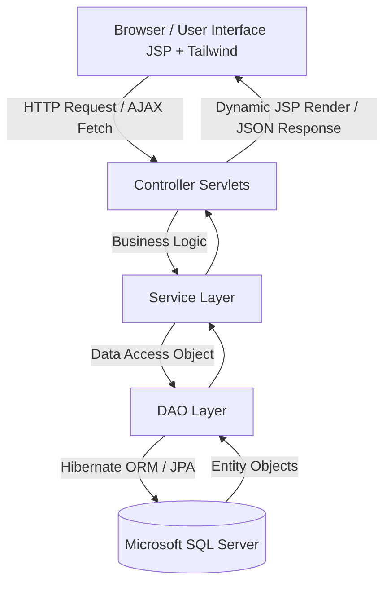

# V-SPORT — Hệ thống số hóa quản lý vận hành cơ sở thể thao & đặt sân trực tuyến


**V-SPORT** là một nền tảng Web App toàn diện được xây dựng trên nền tảng **Java Servlet/JSP (Jakarta EE)** kết hợp với **JPA/Hibernate** và cơ sở dữ liệu **Microsoft SQL Server**. Hệ thống được thiết kế nhằm số hóa quy trình quản lý, vận hành các trung tâm/cơ sở thể thao đa năng (Bóng đá, Cầu lông, Tennis, Bóng rổ, v.v.), hỗ trợ đặt sân trực tuyến tích hợp thanh toán QR, tối ưu hóa phân lịch ca làm việc nhân sự, đồng thời kết nối cộng đồng thông qua mô hình ghép kèo tính điểm ELO độc đáo.

---

## 1. Kiến trúc hệ thống & Công nghệ (System Architecture & Tech Stack)

Hệ thống tuân thủ mô hình kiến trúc **MVC (Model-View-Controller)** truyền thống, chia thành các phân lớp rõ rệt:



### Chi tiết các phân lớp công nghệ:
*   **Core Backend**: Java 17, Jakarta EE 10 (Jakarta Servlet API 6.0.0, Jakarta Server Pages).
*   **Data Persistence (Phần mềm ORM)**: Jakarta Persistence API (JPA) 3.1.0, Hibernate ORM 6.4.4.Final.
*   **Connection Pool (Quản lý kết nối DB)**: HikariCP 5.1.0 cho hiệu suất truy cập database cao, ổn định.
*   **Cơ sở dữ liệu (Database)**: Microsoft SQL Server 2019/2022 (Được cấu hình trong `persistence.xml` với Unit Name: `SportPU`).
*   **Mã hóa mật khẩu**: BCrypt (`jbcrypt 0.4`) băm mật khẩu bảo mật một chiều.
*   **Gửi Email OTP**: Angus Mail API (`jakarta.mail` 2.0.2 & `jakarta.activation` 2.1.2).
*   **Giao diện người dùng (Frontend)**: JSP kết hợp JSTL 3.0.0, Tailwind CSS (JIT CDN), Google Fonts (Inter), Google Material Symbols (Icons).
*   **Build Tool**: Apache Maven (đóng gói dạng `.war` để chạy trên Apache Tomcat 10.1).

---

## 2. Bản đồ cấu trúc thư mục dự án (Directory Structure)

```text
DATN/ (Thư mục gốc dự án)
├── src/
│   ├── main/
│   │   ├── java/org/example/
│   │   │   ├── controller/      # Các Servlets xử lý định tuyến (Routing) & kiểm soát luồng
│   │   │   │   ├── manager/     # Servlet riêng cho vai trò Quản lý
│   │   │   │   └── ...          # Đăng nhập, Đăng ký, Đặt sân, Thanh toán, SOS...
│   │   │   ├── dao/             # Các Interface truy xuất dữ liệu (Data Access Object)
│   │   │   │   └── impl/        # Các lớp triển khai DAO sử dụng EntityManager (JPA/Hibernate)
│   │   │   ├── model/           # Các JPA Entity đại diện cho các bảng trong SQL Server
│   │   │   ├── service/         # Lớp xử lý nghiệp vụ Logic (Business Services)
│   │   │   │   └── manager/     # Nghiệp vụ quản lý ca làm, nhân sự, sân bãi
│   │   │   ├── filter/          # Bộ lọc bảo mật, kiểm tra quyền đăng nhập (Authentication)
│   │   │   └── util/            # Các công cụ tiện ích (JPAUtil, EmailUtil, CaLamValidationEngine...)
│   │   ├── resources/
│   │   │   ├── META-INF/
│   │   │   │   └── persistence.xml # Cấu hình kết nối SQL Server và HikariCP Connection Pool
│   │   │   └── log4j2.xml       # Cấu hình hệ thống ghi nhận lịch sử lỗi (Logging)
│   │   └── webapp/              # Tài nguyên Web tĩnh và động
│   │       ├── admin/           # Trang JSP dành riêng cho Admin hệ thống
│   │       ├── manager/         # Trang JSP quản lý cơ sở (Nhân sự, Ca làm, Yêu cầu...)
│   │       ├── customer/        # Trang đặt sân, lịch sử giao dịch dành cho Khách hàng
│   │       ├── staff/           # Trang dành cho nhân viên trực ca
│   │       └── auth/            # Trang đăng nhập, đăng ký, xác thực OTP
│   └── test/                    # Các kịch bản kiểm thử tự động (Unit Tests)
└── pom.xml                      # Quản lý thư viện phụ thuộc của Maven
```

---

## 3. Các phân hệ chức năng chính (Core Functional Modules)

### Phân hệ 1: Quản lý đặt sân & Hóa đơn (Booking & POS)
*   **Chức năng**: Khách hàng tra cứu danh sách sân trống theo thời gian thực, đặt sân theo khung giờ mong muốn, áp dụng mã khuyến mãi (`KhuyenMai`), nhận hóa đơn thanh toán trực tiếp qua mã QR tĩnh/động (`MaQR`), chia hóa đơn cho nhóm chơi (`ChiaHoaDon`), và yêu cầu hoàn tiền nếu hủy lịch hợp lệ (`Hoantien`).
*   **Thành phần chính**:
    *   *Frontend*: `webapp/customer/dat-san.jsp`, `webapp/customer/history.jsp`
    *   *Backend*: [DatSanServlet.java](file:///d:/New%20folder/V-SPORT/src/main/java/org/example/controller/DatSanServlet.java)
    *   *Thực thể*: `DatSan`, `Lichdatsan`, `HoaDon`, `ChiTietHoaDon`, `ChiaHoaDon`, `Hoantien`, `MaQR`.

### Phân hệ 2: Quản lý nhân sự, Xếp lịch làm việc (Staff Scheduling) & Điểm danh (Attendance)
*   **Chức năng**: Manager phân bổ và điều phối ca làm việc động cho nhân viên tại chi nhánh. Hệ thống tự động kiểm tra xung đột trùng ca, nghỉ phép, quá giờ làm việc và thời gian nghỉ tối thiểu qua động cơ luật (`CaLamValidationEngine`).
    *   **Quy trình đổi ca 2 bước**: Nhân viên gửi yêu cầu đổi ca làm việc cho nhau (`CaLamViecSwapRequest`). Nhân viên nhận yêu cầu phải bấm Đồng ý trước khi yêu cầu được chuyển tiếp lên Quản lý (Manager) để đưa ra quyết định phê duyệt/từ chối cuối cùng.
    *   **Quy trình điểm danh (Check-in/Check-out)**: Nhân viên trực ca thực hiện điểm danh vào ca (Check-in) và kết thúc ca (Check-out) trực quan ngay trên lịch làm việc. Trạng thái đi làm thực tế được ghi nhận tức thời lên màn hình giám sát của Quản lý.
    *   **Đơn xin nghỉ & Nguyện vọng**: Nhân viên gửi nguyện vọng rảnh/bận (`CaLamViecAvailability`) hoặc đơn xin nghỉ phép (`YeuCauNghi`). Tất cả quy trình duyệt từ Quản lý đều thực hiện qua AJAX thời gian thực.
*   **Thành phần chính**:
    *   *Frontend*: [NhanSu.jsp](file:///d:/New%20folder/V-SPORT/src/main/webapp/manager/NhanSu.jsp), [CaLamViec.jsp](file:///d:/New%20folder/V-SPORT/src/main/webapp/manager/CaLamViec.jsp) (Dành cho Quản lý); [CaLamViec.jsp](file:///d:/New%20folder/V-SPORT/src/main/webapp/staff/CaLamViec.jsp) (Dành cho Nhân viên)
    *   *Backend*: [QuanLyCaLamManagerServlet.java](file:///d:/New%20folder/V-SPORT/src/main/java/org/example/controller/QuanLyCaLamManagerServlet.java), [YeuCauNghiManagerServlet.java](file:///d:/New%20folder/V-SPORT/src/main/java/org/example/controller/YeuCauNghiManagerServlet.java), [StaffCaLamServlet.java](file:///d:/New%20folder/V-SPORT/src/main/java/org/example/controller/StaffCaLamServlet.java), [CaLamService.java](file:///d:/New%20folder/V-SPORT/src/main/java/org/example/service/manager/CaLamService.java)
    *   *Thực thể*: `CaLamViec`, `CaLamViecAudit`, `CaLamViecAvailability`, `CaLamViecSwapRequest`, `YeuCauNghi`.

### Phân hệ 3: Ghép kèo cộng đồng & Xếp hạng ELO (Matchmaking)
*   **Chức năng**: Cho phép người chơi đơn lẻ hoặc đội nhóm tạo/tìm kiếm các trận đấu giao lưu (Ghép kèo - `GhepKeo`). Sau mỗi trận đấu, dựa trên kết quả ghi nhận, hệ thống tính toán điểm số ELO tích lũy (`LichSuElo`) tương tự các bảng xếp hạng eSports để xếp hạng và ghép các cặp đối thủ có trình độ tương đồng, nâng cao tính hấp dẫn.
*   **Thành phần chính**:
    *   *Thực thể*: `GhepKeo`, `ChiTietGhepKeo`, `LichSuElo`.

### Phân hệ 4: Tiện ích vận hành IoT (An ninh & Bãi giữ xe)
*   **Chức năng**:
    *   *An ninh*: Tích hợp cơ chế cảnh báo SOS khẩn cấp (`YeuCauSOS`, `NhatKySOSGui`) tại chỗ để nhân viên lập tức nhận biết sân nào đang cần hỗ trợ an ninh/y tế.
    *   *Nhà xe*: Quản lý thẻ xe (`TheGiuXe`) gắn với mã vạch/RFID, lưu vết giờ vào/ra của các phương tiện (`LichXeRaVao`) nâng cao an toàn tài sản cơ sở.
*   **Thành phần chính**:
    *   *Thực thể*: `TheGiuXe`, `LichXeRaVao`, `YeuCauSOS`, `NhatKySOSGui`.

### Phân hệ 5: Quản lý Kho hàng & Dịch vụ đi kèm (Inventory & Add-on Services)
*   **Chức năng**: Quản lý danh mục hàng hóa (`DanhMucSanPham`), sản phẩm và dịch vụ cho thuê/bán lẻ tại quầy (`SanPham_DichVu`), quản lý số lượng tồn kho của chi nhánh, theo dõi nhập/xuất kho. Áp dụng cơ chế khóa bi quan (`LockModeType.PESSIMISTIC_WRITE`) khi xuất/nhập kho để tránh race condition và đảm bảo tính toàn vẹn dữ liệu.
*   **Thành phần chính**:
    *   *Frontend*: [KhoDichVu.jsp](file:///d:/New%20folder/V-SPORT/src/main/webapp/manager/KhoDichVu.jsp)
    *   *Backend*: [KhoDichVuManagerServlet.java](file:///d:/New%20folder/V-SPORT/src/main/java/org/example/controller/manager/KhoDichVuManagerServlet.java)
    *   *Thực thể*: `SanPham_DichVu`, `DanhMucSanPham`.

### Phân hệ 6: Quản lý Sân bãi & Loại sân (Facility & Court Management)
*   **Chức năng**: Cấu hình và quản lý danh mục loại sân (`LoaiSan`), các sân bóng, cầu lông, tennis cụ thể (`San`) trực thuộc chi nhánh; theo dõi trực quan trạng thái sân (Sẵn sàng, Đang hoạt động, Bảo trì) theo thời gian thực.
*   **Thành phần chính**:
    *   *Frontend*: [QuanLySan.jsp](file:///d:/New%20folder/V-SPORT/src/main/webapp/manager/QuanLySan.jsp)
    *   *Backend*: [QuanLySanManagerServlet.java](file:///d:/New%20folder/V-SPORT/src/main/java/org/example/controller/QuanLySanManagerServlet.java), [QuanLySanServlet.java](file:///d:/New%20folder/V-SPORT/src/main/java/org/example/controller/QuanLySanServlet.java)
    *   *Thực thể*: `San`, `LoaiSan`, `CoSo`.

### Phân hệ 7: Quản lý Khách hàng & Đánh giá dịch vụ (Customer & Feedback Management)
*   **Chức năng**: Theo dõi danh sách khách hàng hoạt động tại chi nhánh, xem thông tin giao dịch, số ca đã chơi, điểm tích lũy uy tín và thống kê mức độ tương tác. Xem danh sách phản hồi/đánh giá sao (`DanhGia`) của khách hàng để nâng cấp chất lượng phục vụ.
*   **Thành phần chính**:
    *   *Backend*: [CustomerManagerServlet.java](file:///d:/New%20folder/V-SPORT/src/main/java/org/example/controller/manager/CustomerManagerServlet.java)
    *   *Thực thể*: `TaiKhoan`, `DanhGia`.

---

## 4. Từ điển Thực thể Cơ sở dữ liệu (JPA Entities Dictionary)

Hệ thống quản lý thông tin thông qua **32 JPA Entities** chính dưới đây:

| STT | Tên Thực thể (JPA Entity) | Mô tả chi tiết vai trò trong hệ thống |
|:---:|---|---|
| 1 | **TaiKhoan** | Lưu trữ thông tin tài khoản người dùng (Khách hàng, nhân viên, quản lý, admin). |
| 2 | **VaiTro** | Định nghĩa các quyền của tài khoản (Admin, Manager, Staff, Customer, Owner). |
| 3 | **CoSo** | Lưu trữ thông tin các chi nhánh / cơ sở thể thao trong hệ thống chuỗi. |
| 4 | **MonTheThao** | Định nghĩa môn thể thao được cung cấp (Bóng đá, Cầu lông, Bóng rổ...). |
| 5 | **LoaiSan** | Phân loại sân theo chất lượng / kích thước (Sân 5 người, Sân 7 người, Sân cỏ nhân tạo...). |
| 6 | **San** | Các sân cụ thể trực thuộc một chi nhánh cơ sở nhất định. |
| 7 | **DatSan** | Ghi nhận yêu cầu đặt lịch sân của khách hàng (Ngày, giờ, tổng tiền, trạng thái). |
| 8 | **Lichdatsan** | Lịch chi tiết đã được giữ chỗ theo khung giờ cụ thể để tránh đặt trùng. |
| 9 | **HoaDon** | Lưu trữ thông tin hóa đơn thanh toán cho mỗi giao dịch đặt sân hoặc dịch vụ đi kèm. |
| 10 | **ChiTietHoaDon** | Lưu trữ chi tiết các sản phẩm/dịch vụ mua thêm (Nước uống, thuê giày, bóng...). |
| 11 | **ChiaHoaDon** | Hỗ trợ tính năng chia nhỏ hóa đơn để nhóm người chơi thanh toán chung. |
| 12 | **Hoantien** | Quản lý quy trình xử lý yêu cầu hoàn tiền khi khách hàng hủy lịch hợp lệ. |
| 13 | **KhuyenMai** | Thông tin mã giảm giá, chương trình ưu đãi áp dụng vào hóa đơn đặt sân. |
| 14 | **CaLamViec** | Quản lý lịch phân ca làm việc của từng nhân viên theo ngày, giờ. |
| 15 | **CaLamViecAudit** | Lưu nhật ký thay đổi ca làm việc (ai thay đổi, thời gian, lý do) để kiểm soát nội bộ. |
| 16 | **CaLamViecAvailability** | Nguyện vọng báo thời gian rảnh/bận của nhân viên phục vụ xếp ca tự động. |
| 17 | **CaLamViecSwapRequest** | Quản lý luồng yêu cầu đổi ca làm việc giữa các nhân viên và phê duyệt của Manager. |
| 18 | **YeuCauNghi** | Quản lý đơn xin nghỉ phép của nhân viên (Ngày nghỉ, lý do, duyệt/từ chối). |
| 19 | **GhepKeo** | Quản lý các phòng chờ ghép trận đấu thể thao giữa các cá nhân/nhóm chơi. |
| 20 | **ChiTietGhepKeo** | Danh sách những người tham gia vào một kèo đấu ghép sân cụ thể. |
| 21 | **LichSuElo** | Nhật ký biến động điểm xếp hạng (ELO) của người chơi sau mỗi trận đấu. |
| 22 | **TheGiuXe** | Quản lý danh mục thẻ xe thông minh của chi nhánh. |
| 23 | **LichXeRaVao** | Ghi nhận nhật ký xe vào/ra bãi đỗ xe gắn liền với mã số thẻ xe. |
| 24 | **YeuCauSOS** | Các nút báo động khẩn cấp được thiết lập tại sân thể thao. |
| 25 | **NhatKySOSGui** | Lưu nhật ký thời gian và vị trí gửi cảnh báo khẩn cấp cần nhân viên xử lý. |
| 26 | **DanhGia** | Phản hồi, điểm đánh giá sao của khách hàng đối với dịch vụ cơ sở thể thao. |
| 27 | **SanPham_DichVu** | Danh mục nước uống, đồ ăn, vật dụng thể thao cho thuê hoặc bán tại quầy. |
| 28 | **DanhMucSanPham** | Danh mục phân loại sản phẩm/dịch vụ. |
| 29 | **ThongBao** | Hệ thống gửi thông điệp thông báo cho người dùng (Đã xếp ca, được duyệt nghỉ phép...). |
| 30 | **MonTheThaoYeuThich** | Lưu trữ sở thích thể thao của khách hàng nhằm gợi ý ghép kèo thích hợp. |
| 31 | **NhatKyChat** | Ghi nhận tin nhắn trao đổi trong phòng chờ ghép kèo thể thao. |
| 32 | **MaQR** | Mã QR liên kết phục vụ thanh toán nhanh trực tuyến hoặc check-in. |

---

## 5. Ma trận Phân quyền Tài khoản (User Roles Matrix)

Hệ thống quản lý chặt chẽ theo 5 vai trò tài khoản cốt lõi:

*   **1. Admin (Quản trị viên tối cao)**:
    *   Quản lý toàn bộ cơ sở dữ liệu hệ thống chuỗi.
    *   Thêm mới, sửa thông tin chi nhánh cơ sở (`MonTheThao`, `LoaiSan`, `CoSo`).
    *   Cấu hình phân hạng ELO và xem báo cáo tổng doanh thu toàn chuỗi.
*   **2. Manager (Quản lý chi nhánh cơ sở)**:
    *   Quản lý trực tiếp các sân (`San`) và phân bổ ca làm việc (`CaLamViec`) cho nhân viên thuộc chi nhánh.
    *   Phê duyệt đơn xin nghỉ phép (`YeuCauNghi`), yêu cầu đổi ca (`CaLamViecSwapRequest`).
    *   Xem biểu đồ thống kê doanh thu, tần suất sử dụng sân, dịch vụ kho hàng của chi nhánh.
*   **3. Staff (Nhân viên trực ca: Lễ tân, Bảo vệ)**:
    *   *Lễ tân*: Bán dịch vụ tại quầy, kích hoạt QR hóa đơn, tiếp nhận yêu cầu SOS khẩn cấp.
    *   *Bảo vệ*: Check-in/check-out xe ra vào bãi đỗ thông qua thẻ xe thông minh.
    *   Xem ca làm cá nhân, báo cáo nguyện vọng rảnh, gửi đơn nghỉ phép.
*   **4. Customer (Khách hàng sử dụng dịch vụ)**:
    *   Tìm kiếm sân trống, đặt lịch chơi, thanh toán trực tuyến qua cổng QR (PayOS).
    *   Tham gia ghép kèo ELO, chat nhóm, gửi đánh giá phản hồi.
*   **5. Owner (Chủ thương hiệu)**:
    *   Đăng ký tạo thương hiệu chuỗi thể thao mới trên nền tảng.

---

## 6. Hướng dẫn thiết lập & Vận hành dự án (Installation & Deployment)

### Yêu cầu hệ thống tối thiểu:
*   Java Development Kit (JDK) 17 hoặc cao hơn.
*   Apache Maven 3.8+.
*   Microsoft SQL Server 2019+.
*   Apache Tomcat Server 10.1+.

### Bước 1: Khởi tạo Cơ sở dữ liệu
1.  Cài đặt MS SQL Server và khởi chạy SQL Server Agent.
2.  Tạo một cơ sở dữ liệu trống tên là `QuanLiSport`.
3.  Thực hiện chạy các script SQL khởi tạo schema.

### Bước 2: Cấu hình kết nối Database
Mở file cấu hình JPA tại đường dẫn: `src/main/resources/META-INF/persistence.xml` và cập nhật thông tin tài khoản SQL Server của bạn:
```xml
<property name="jakarta.persistence.jdbc.url" value="jdbc:sqlserver://localhost:1433;databaseName=QuanLiSport;encrypt=true;trustServerCertificate=true;"/>
<property name="jakarta.persistence.jdbc.user" value="sa"/>
<property name="jakarta.persistence.jdbc.password" value="Mật_khẩu_của_bạn"/>
```

### Bước 3: Đóng gói dự án bằng Maven
Chạy lệnh dưới đây tại thư mục gốc của dự án (nơi có file `pom.xml`) để tải các thư viện và đóng gói thành file `.war`:
```bash
mvn clean package
```
Sau khi chạy thành công, file `Backend_java-1.0-SNAPSHOT.war` sẽ được tạo ra trong thư mục `target/`.

### Bước 4: Chạy trên Apache Tomcat 10.1
1.  Copy file `.war` vào thư mục `webapps/` của Tomcat hoặc cấu hình trực tiếp deployment trong IDE sử dụng plugin **SmartTomcat** (chỉ định context path là `/`).
2.  Truy cập hệ thống thông qua địa chỉ: `http://localhost:8080/`.

---

## 7. Quy trình phát triển & Quy chuẩn Nghiệp vụ (Standard Operating Procedures)

### A. Quy trình Đặt sân & Khóa chỗ Tạm thời (Soft-Hold vs PayOS Timeout)
Để tối ưu hóa trải nghiệm khách hàng và tránh tranh chấp sân, hệ thống áp dụng cơ chế khóa 2 lớp:
1.  **Soft-Hold 2 phút**: Ngay khi khách chọn xong khung giờ hợp lệ, hệ thống tạo bản ghi tạm trong bảng `SoftHold` để giữ chỗ trong 2 phút (do `SOFT_HOLD_TIMEOUT_MINUTES` quy định). Nếu quá 2 phút khách không thanh toán, sân tự động mở lại cho người khác. Khách hàng không bị chính mình khóa (`AccountID <> ?`).
2.  **PayOS Timeout 10 phút**: Khi chuyển đến trang thanh toán trực tuyến, trạng thái lịch đặt chuyển thành `Chờ thanh toán`. CSDL lưu thời điểm tạo qua cột `CreatedTime`. Sau 10 phút nếu không nhận được webhook thanh toán thành công, hệ thống coi ca đặt này đã hết hạn và tự động bỏ qua khi quét trùng lịch (self-healing), không cần cron job dọn dẹp.
3.  **Khóa dòng bi quan**: Khi ghi nhận đặt sân hoặc Check-in vãng lai của Lễ tân, hệ thống sử dụng `WITH (UPDLOCK, ROWLOCK)` trên bảng `San` để loại bỏ hoàn toàn race condition ở mức độ mili-giây.

### B. Quy trình Xếp ca & Hoán đổi lịch (Scheduling & Swapping Flow)
Quy trình phân ca và chấm công được vận hành chặt chẽ để đảm bảo tính minh bạch:
1.  **Hệ thống trạng thái ca làm**: `Draft` (Nháp) $\rightarrow$ `Published` (Công bố) $\rightarrow$ `Confirmed` (Xác nhận đi làm) $\rightarrow$ `CheckedIn` (Đang làm việc) $\rightarrow$ `CheckedOut` (Đã hoàn thành).
2.  **Quy trình đổi ca 2 bước**:
    *   **Bước 1 (Nhân viên $\rightarrow$ Nhân viên)**: Nhân viên A gửi yêu cầu đổi ca cho nhân viên B $\rightarrow$ Yêu cầu ở trạng thái `ChoXacNhan`. B nhận thông báo và bấm Đồng ý $\rightarrow$ Yêu cầu đổi thành `ChoQuanLyDuyet`.
    *   **Bước 2 (Quản lý duyệt)**: Manager kiểm tra yêu cầu trên màn hình điều phối. Khi duyệt, hệ thống tự động chạy kiểm tra xung đột chéo 2 chiều. Nếu hợp lệ, hệ thống hoán đổi `AccountId` trực tiếp trong CSDL và ghi log audit. Nếu không hợp lệ, hệ thống tự chuyển trạng thái sang `TuChoi` kèm lý do chi tiết và thông báo lại cho 2 nhân sự.
3.  **Điểm danh thời gian thực**: Nhân viên chỉ được bấm check-in/check-out ca làm việc trong ngày hôm nay. Trạng thái `CheckedIn` hiển thị pulsing live-dot trên màn hình giám sát của Manager giúp quản lý trực quan nhân sự thực tế tại chi nhánh.

### C. Quy trình An toàn kho hàng & Dọn dẹp bộ nhớ đệm
1.  **Khóa ghi bi quan kho hàng**: Mọi hoạt động nhập/xuất kho đều áp dụng khóa `LockModeType.PESSIMISTIC_WRITE` khi tải thông tin sản phẩm nhằm loại bỏ lỗi lost update khi nhiều nhân viên bán hàng cùng lúc.
2.  **Giao dịch nguyên tử (Presets)**: Hoạt động nạp sản phẩm mẫu mặc định được bọc trong một transaction duy nhất để đảm bảo rollback sạch sẽ nếu lỗi.
3.  **Dọn dẹp danh mục trùng lặp**: Sử dụng static lock (`categoryLock`) và cờ volatile `categoryCleaned` trong `KhoDichVuManagerServlet` giúp tiến trình dọn dẹp chỉ kích hoạt duy nhất một lần khi hệ thống startup, tránh tải lại chậm.

### D. Quy trình Bảo mật & Kiểm soát chéo (IDOR Prevention & Branch Isolation)
1.  **Bảo vệ dữ liệu chi nhánh**: Tuyệt đối không tin tưởng chi nhánh từ client truyền lên. Tất cả API của Manager đều lấy `CoSoId` trực tiếp từ session của Manager đã đăng nhập.
2.  **Chống IDOR**: Trước khi cập nhật thông tin nhân viên, duyệt đơn nghỉ phép, hoặc hoán đổi ca làm, Service Layer bắt buộc phải gọi `BranchSecurityUtils.checkBranchAccess(targetCoSoId, managerCoSoId)` để ngăn quản lý chi nhánh A thao tác dữ liệu chi nhánh B.
3.  **Giấu chi tiết lỗi**: Cấm kết xuất lỗi thô (`e.getMessage()`) ra client đối với các lỗi CSDL. Thay thế bằng mã lỗi/thông báo an toàn để bảo mật cấu trúc hệ thống.

---

## 8. Ma trận Validation Hệ thống Đặt Sân (Booking Validation)

Tất cả validation đều thực hiện **server-side** (không tin tưởng client). Được chia thành 4 nhóm theo luồng nghiệp vụ.

### Nhóm 1: Validation Ngày/Giờ (Khách hàng đặt sân)
Vị trí: [`DatSanServlet.java`](file:///d:/New%20folder/V-SPORT/src/main/java/org/example/controller/DatSanServlet.java) — phương thức `handleDatSan()`.

| # | Rule | Điều kiện chặn | Thông báo lỗi |
|---|------|---------------|---------------|
| T1 | Không đặt ngày quá khứ | `ngayDat < today` | "Không thể đặt sân cho ngày đã qua." |
| T2 | Không đặt giờ đã qua (hôm nay) | `ngayDat == today && gioBatDau < now` | "Không thể đặt sân cho giờ đã qua trong ngày hôm nay." |
| T3 | Không đặt quá xa tương lai | `ngayDat > today + 30 ngày` | "Chỉ có thể đặt sân trong vòng 30 ngày tới (tối đa đến ngày X)." |
| T4 | Giờ kết thúc phải sau giờ bắt đầu | `gioKetThuc <= gioBatDau` | "Giờ kết thúc phải sau giờ bắt đầu." |
| T5 | Thời lượng tối thiểu 30 phút | `duration < 30 phút` | "Thời lượng đặt sân tối thiểu cho mỗi lượt là 30 phút." |
| T6 | Thời lượng tối đa 4 giờ | `duration > 240 phút` | "Thời lượng đặt sân tối đa cho mỗi lượt là 4 giờ (240 phút)." |
| T7 | Giờ trong khung hoạt động cơ sở | `gioBatDau < GioMoCua` hoặc `gioKetThuc > GioDongCua` | "Cơ sở mở cửa lúc X. Giờ của bạn quá sớm/muộn." |

### Nhóm 2: Validation Trùng lịch & Trạng thái Sân
Vị trí: [`DatSanServlet.java`](file:///d:/New%20folder/V-SPORT/src/main/java/org/example/controller/DatSanServlet.java) — bên trong transaction (sau khi khóa dòng `San`).

| # | Rule | Điều kiện chặn | Ghi chú |
|---|------|---------------|---------|
| C1 | Sân phải ở trạng thái "Sẵn sàng" | `TrangThai != 'Sẵn sàng'` | Chặn đặt sân đang bảo trì/đang dùng |
| C2 | Không trùng booking đã confirm/đang dùng | Overlap với `Đã xác nhận`, `Đang sử dụng`, `Đã hoàn thành` | Công thức: `NOT (end1 <= start2 OR start1 >= end2)` |
| C3 | Không trùng PayOS chưa hết 10 phút | Overlap với `Chờ thanh toán` trong 10 phút | Tự giải phóng sau 10 phút — không cần cron job |
| C4 | Không trùng SoftHold của người khác | Overlap với `SoftHold` active (< 2 phút) từ `AccountID` khác | Self-hold không bị chặn chính mình |

### Nhóm 3: Validation Duyệt / Từ chối (Manager & Staff)
Vị trí: [`LichDatSanDAOImpl.java`](file:///d:/New%20folder/V-SPORT/src/main/java/org/example/dao/impl/LichDatSanDAOImpl.java) — `duyetLichDatSan()` và `tuChoiLichDatSan()`.

| # | Rule | Điều kiện chặn | Ghi chú |
|---|------|---------------|---------|
| D1 | Không duyệt booking đã quá giờ | `NgayDat < today` hoặc `(NgayDat == today && GioBatDau < now)` | Chống duyệt lịch lỗi thời |
| D2 | Chỉ duyệt trạng thái "Chờ xác nhận" | `TrangThai != 'Chờ xác nhận'` | Tránh duyệt 2 lần gây xung đột |
| D3 | Không duyệt nếu có conflict mới | Booking khác đã confirm trùng khung giờ trong race condition | Kiểm tra lại thời điểm duyệt |
| D4 | Nhân sự chỉ duyệt sân cơ sở mình | `San.CoSoID != coSoId` của người duyệt | Phân quyền chi nhánh nghiêm ngặt |
| D5 | Lý do từ chối bắt buộc | `reason == null \|\| reason.trim().isEmpty()` | Bắt buộc đối với hành động từ chối |
| D6 | Tự động hủy đơn chờ trùng lịch | Khi một đơn được duyệt, các đơn chờ xác nhận trùng khung giờ | Chuyển sang trạng thái `Đã hủy` tự động |

### Nhóm 4: Validation Hủy Booking (Khách hàng)
Vị trí: [`DatSanServlet.java`](file:///d:/New%20folder/V-SPORT/src/main/java/org/example/controller/DatSanServlet.java) — phương thức `handleHuyDatSan()`.

| # | Rule | Điều kiện chặn | Ghi chú |
|---|------|---------------|---------|
| H1 | Chỉ hủy đơn của chính mình | `lich.getAccountId() != user.getAccountId()` | Chống IDOR |
| H2 | Chỉ hủy trạng thái "Chờ xác nhận" | `TrangThai != 'Chờ xác nhận'` | Đơn đã thanh toán/xác nhận không tự ý hủy |
| H3 | Phải hủy trước 6 tiếng | `now + 6h > GioBatDau` | Tránh hủy sát giờ làm trống sân |

---

## 9. Ma trận Validation Hệ thống Phân ca làm việc (Staff Scheduling)

Hệ thống điều phối nhân sự áp dụng mô hình validation 2 tầng (Tầng Engine xác thực luật lao động/xung đột và Tầng Nghiệp vụ điều phối luồng thao tác) để đảm bảo tuân thủ nghiêm ngặt Luật Lao Động Việt Nam và tối ưu hóa vận hành chi nhánh.

### Tầng 1: Động cơ luật & Xung đột lịch (`CaLamValidationEngine`)
Được thiết kế để kiểm tra các xung đột thời gian thực cho một ca đơn cụ thể, trả về đối tượng `ValidationResult` chứa danh sách các `ValidationItem` (`code`, `message`, `field`, `context`).

| Mã Rule | Tên Luật / Nghiệp vụ | Loại | Điều kiện kiểm tra / Xử lý |
|:---:|---|:---:|---|
| **R1** | Chặn xếp ca trong quá khứ | ERROR | Không cho phép tạo ca mới có ngày làm việc trước hôm nay (`excludeId == null && ngayLam < today`). |
| **R2** | Thời lượng ca tối thiểu | ERROR | Thời lượng ca thực tế (đã trừ thời gian nghỉ giữa ca) phải từ 30 phút trở lên. |
| **R3** | Cảnh báo ca quá dài | WARNING | Một ca đơn kéo dài trên 10 tiếng liên tục (cảnh báo nguy cơ quá tải/burnout). |
| **R4** | Giờ nghỉ bắt buộc giữa ca | WARNING | Ca làm việc thực tế trên 6 tiếng yêu cầu thời gian nghỉ giữa ca ít nhất 30 phút (Bộ Luật Lao Động). |
| **R5** | Xác thực vai trò phân công | ERROR | Chỉ phân công ca làm việc cho nhân sự có vai trò Staff (`roleId == ROLE_STAFF`). Chặn phân ca cho Manager/Admin. |
| **R6** | Phân quyền chi nhánh | ERROR | Chỉ gán ca làm việc của chi nhánh X cho nhân viên trực thuộc chi nhánh X (`staff.coSoId == coSoId`). |
| **R7** | Ngày nghỉ hàng tuần | WARNING | Quét trong 7 ngày liên tiếp xung quanh ca; cảnh báo nếu nhân viên làm việc liên tục 7 ngày không có ngày nghỉ (Điều 111 BLLĐ). |
| **R8** | Trạng thái đang hoạt động | ERROR | Chặn chỉnh sửa hoặc xóa ca làm việc khi nhân viên đã check-in thực tế (`TrangThai == 'CheckedIn'`). |
| **R9** | Trạng thái đã hoàn thành | ERROR | Chặn chỉnh sửa hoặc xóa ca làm việc đã hoàn thành check-out (`TrangThai == 'CheckedOut'`). |
| **R10** | Ca làm việc đã xác nhận | WARNING | Đưa ra cảnh báo gửi thông báo khi cập nhật một ca làm việc đã được nhân viên bấm xác nhận (`Confirmed`). |
| **R11** | Đơn nghỉ phép chờ duyệt | WARNING | Cảnh báo nếu nhân viên có yêu cầu nghỉ phép (`YeuCauNghi`) ở trạng thái `ChoDuyet` trùng vào ngày đó. |
| **L_FULL** | Trùng lịch nghỉ cả ngày | ERROR | Chặn xếp ca trùng ngày với lịch nghỉ phép cả ngày đã được phê duyệt (`DaDuyet`). |
| **L_MOR** | Trùng lịch nghỉ buổi sáng | ERROR | Chặn xếp ca có giờ bắt đầu trước 12:00 trùng ngày nghỉ buổi sáng của nhân viên. |
| **L_AFT** | Trùng lịch nghỉ buổi chiều | ERROR | Chặn xếp ca có thời gian giao thoa với buổi chiều (sau 12:00) trùng ngày nghỉ buổi chiều của nhân viên. |
| **OVERLAP**| Trùng ca làm việc khác | ERROR | Sử dụng phép so sánh số phút tuyệt đối trên epoch day để phát hiện chính xác mọi ca trùng lặp (kể cả ca qua đêm). |
| **REST** | Thời gian nghỉ giữa 2 ca | WARNING | Khoảng cách nghỉ giữa ca làm liền trước hoặc ca làm liền sau với ca đang xét phải từ 12 tiếng trở lên. |
| **LIMIT** | Giới hạn giờ làm ngày/tuần | ERROR/WARN| - ERROR: Tổng giờ làm > 12h/ngày hoặc > 48h/tuần.<br>- WARNING: Tổng giờ làm > 8h/ngày hoặc > 40h/tuần. |

### Tầng 2: Kiểm soát luồng nghiệp vụ (`CaLamService` / Controllers)
Đảm bảo tính nhất quán dữ liệu trước và sau các thao tác ghi nhận vào Cơ sở dữ liệu.

*   **3.1 Luồng Tạo Ca (`createShift`)**:
    *   *Input Validate*: Kiểm tra cứng `accountId > 0`, các trường ngày giờ không null.
    *   *Repeat limits*: Loại lặp phải thuộc `{none, daily, weekly}`. Hạn chế lặp tối đa 3 tháng và tổng số ca tạo mới một lần không quá `90` ca để bảo vệ CSDL.
    *   *Engine Validate*: Chạy kiểm tra luật cho từng ngày trong dãy lặp. Nếu xuất hiện bất kỳ `ERROR` nào $\rightarrow$ Rollback toàn bộ danh sách.
    *   *Post-create*: Tự động gửi thông báo `ThongBao` cho nhân viên nếu ca tạo mới ở trạng thái đã công bố (`Published` hoặc `Confirmed`).
*   **3.2 Luồng Sửa Ca (`updateShift`)**:
    *   *Status guard*: Chặn sửa ca đã `CheckedIn` hoặc `CheckedOut`. Đối với ca `Confirmed`, yêu cầu truyền cờ `overrideConfirm` từ quản lý.
    *   *Date check*: Chặn thay đổi ngày làm việc của ca đã công bố về quá khứ.
    *   *Engine validate*: Kiểm tra luật của nhân viên mới với tùy chọn loại trừ chính ID ca đang chỉnh sửa (`excludeCaLamViecId`).
*   **3.3 Luồng Xóa Ca (`deleteShift`)**:
    *   *Status guard*: Chặn xóa cứng ca đã `CheckedIn` hoặc `CheckedOut`.
    *   *Reason check*: Ca đã `Published` hoặc `Confirmed` bắt buộc phải nhập lý do xóa (`deleteReason` không rỗng) phục vụ audit. Ca `Draft` được xóa tự do.
*   **3.5 Luồng Công Bố Tuần (`publishWeekShifts`)**:
    *   *Date check*: Chỉ cho phép công bố tuần bắt đầu từ thứ Hai.
    *   *Data check*: Phải có ít nhất 1 ca ở trạng thái `Draft`/`Unpublished` trong tuần đích (tránh công bố tuần rỗng).
    *   *Cảnh báo trống*: Cảnh báo nếu có ca chưa gán người hoặc có ngày làm việc không có bất kỳ ca trực nào.
    *   *Thông báo thông minh*: Chỉ gửi thông báo công bố lịch cho nhân sự tối đa 1 lần/ngày đối với loại thông báo này để tránh spam.
*   **3.6 Luồng Duyệt Đổi Ca (`approveSwapRequest`)**:
    *   *Ca nguồn check*: Ca hoán đổi phải còn ở trạng thái `Published` hoặc `Confirmed` (chưa check-in).
    *   *Re-validate 2 chiều*: Chạy động cơ kiểm tra chéo: gán nhân viên nhận vào ca của người gửi, và gán nhân viên gửi vào ca của người nhận (nếu có đổi ca 2 chiều).
    *   *Auto reject*: Nếu phát sinh bất kỳ xung đột lịch mới nào, hệ thống tự chuyển trạng thái yêu cầu đổi ca sang `TuChoi` kèm lý do chi tiết và gửi thông báo cho cả 2 nhân viên.
*   **3.7 Luồng Tự Động Sắp Lịch (`autoScheduleShifts`)**:
    *   *Date validation*: Khoảng thời gian sắp lịch không vượt quá 30 ngày.
    *   *Availability check*: Chỉ gán lịch dựa trên nguyện vọng rảnh (`Ranh` - `DaDuyet`) có ngày bằng hoặc sau hôm nay.
    *   *Report*: Tổng hợp số ca được gán thành công và số ca không có nhân sự phù hợp. Thao tác sẽ báo lỗi nếu không gán được ca nào (`scheduledCount == 0`).

---

## 10. Nhật ký cập nhật & Đặc tả UI (Changelog & UI Specifications)

### Cập nhật ngày 01/07/2026 — Nâng cấp giao diện Quản lý Ca làm việc (`CaLamViec.jsp`)
Vị trí file: [CaLamViec.jsp](file:///d:/New%20folder/V-SPORT/src/main/webapp/manager/CaLamViec.jsp)

#### UI-1: Modal xác nhận lý do xóa ca (`deleteReasonModal`)
*   **Khi nào hiển thị**: Khi manager bấm nút Xóa trên một ca có trạng thái `Published` hoặc `Confirmed`.
*   **Các field cần điền**:
    *   *Lý do xóa* (`#deleteReasonInput`): Textarea, bắt buộc, không được để trống.
*   **Kịch bản kiểm thử (Test cases)**:
    - [ ] Xóa ca `Draft` $\rightarrow$ không hiện modal, chỉ hiện `confirm()` thông thường $\rightarrow$ xóa thành công.
    - [ ] Xóa ca `Published` $\rightarrow$ modal mở, label hiển thị "Đã công bố".
    - [ ] Xóa ca `Confirmed` $\rightarrow$ modal mở, label hiển thị "Đã xác nhận".
    - [ ] Bấm "Xác nhận xóa" khi `#deleteReasonInput` rỗng $\rightarrow$ hiển thị toast lỗi "Vui lòng nhập lý do xóa", không đóng modal.
    - [ ] Nhập lý do và bấm "Xác nhận xóa" $\rightarrow$ modal đóng, toast success "Đã xóa ca làm việc thành công!", lịch reload.
    - [ ] Bấm "Hủy" $\rightarrow$ modal đóng, không thực hiện hành động xóa.
*   *Backend validation tương ứng*: Luồng 3.3 — `reason` bắt buộc khi trạng thái là `Published` hoặc `Confirmed`.

#### UI-2: Modal ghi đè ca đã xác nhận (`confirmedOverrideModal`)
*   **Khi nào hiển thị**: Khi manager chỉnh sửa ca có trạng thái `Confirmed` và backend trả về mã lỗi `CONFIRMED_OVERRIDE_REQUIRED`.
*   **Các field cần điền**:
    *   *Lý do ghi đè* (`#overrideReasonInput`): Textarea, bắt buộc.
*   **Kịch bản kiểm thử (Test cases)**:
    - [ ] Sửa ca `Draft`/`Published` $\rightarrow$ modal không xuất hiện.
    - [ ] Sửa ca `Confirmed` lần đầu $\rightarrow$ backend trả về `CONFIRMED_OVERRIDE_REQUIRED` $\rightarrow$ modal mở.
    - [ ] Bấm "Xác nhận & Lưu" khi `#overrideReasonInput` rỗng $\rightarrow$ hiển thị toast lỗi, không gửi request.
    - [ ] Nhập lý do và bấm "Xác nhận & Lưu" $\rightarrow$ request gửi lại với cờ `overrideConfirm=true` kèm lý do $\rightarrow$ toast success, lịch reload.
    - [ ] Bấm "Hủy" $\rightarrow$ modal đóng, ca giữ nguyên.
    - [ ] Sửa ca `CheckedIn` hoặc `CheckedOut` $\rightarrow$ backend chặn cứng (modal ghi đè không xuất hiện).
*   *Backend validation tương ứng*: Luồng 3.2 — kiểm tra cờ `overrideConfirm` + cảnh báo R10.

#### UI-3: Panel hành động nâng cao — Nhân bản tuần (`cloneWeekShifts`)
*   **Vị trí**: Section "Hành động nâng cao" $\rightarrow$ card "Nhân bản tuần".
*   **Các field cần chọn**:
    *   *Tuần nguồn* (`#cloneFromWeek`): Date picker, hệ thống tự động lấy thứ Hai của tuần chứa ngày đã chọn.
    *   *Tuần đích* (`#cloneToWeek`): Date picker, tương tự.
*   **Kịch bản kiểm thử (Test cases)**:
    - [ ] Để trống một trong hai ngày $\rightarrow$ hiển thị toast lỗi "Vui lòng chọn tuần nguồn và tuần đích".
    - [ ] Chọn cùng một tuần cho cả nguồn và đích $\rightarrow$ backend kiểm tra và báo lỗi.
    - [ ] Chọn tuần nguồn có ca, tuần đích chưa có ca $\rightarrow$ nhân bản thành công, lịch reload.
    - [ ] Nếu backend trả về danh sách `warnings[]` $\rightarrow$ hiển thị từng toast cảnh báo tương ứng.

#### UI-4: Panel hành động nâng cao — Công bố tuần (`publishWeekShifts`)
*   **Vị trí**: Section "Hành động nâng cao" $\rightarrow$ card "Công bố tuần".
*   **Các field cần chọn**:
    *   *Ngày trong tuần* (`#publishWeekDate`): Date picker.
*   **Kịch bản kiểm thử (Test cases)**:
    - [ ] Để trống `#publishWeekDate` $\rightarrow$ hiển thị toast lỗi "Vui lòng chọn tuần cần công bố".
    - [ ] Chọn ngày hợp lệ $\rightarrow$ hộp thoại `confirm()` xác nhận công bố xuất hiện.
    - [ ] Bấm "Hủy" $\rightarrow$ không gửi request.
    - [ ] Bấm "OK" $\rightarrow$ gửi request `action=publishWeek`, hiển thị toast success kèm số ca công bố.
    - [ ] Tuần không có ca `Draft` $\rightarrow$ hiển thị toast lỗi từ backend.
    - [ ] Backend trả về `warnings[]` $\rightarrow$ hiển thị từng toast cảnh báo.

#### UI-5: Panel hành động nâng cao — Tự động sắp lịch (`autoScheduleShifts`)
*   **Vị trí**: Section "Hành động nâng cao" $\rightarrow$ card "Tự động sắp lịch".
*   **Các field cần chọn**:
    *   *Từ ngày* (`#autoStartDate`): Date picker.
    *   *Đến ngày* (`#autoEndDate`): Date picker.
*   **Kịch bản kiểm thử (Test cases)**:
    - [ ] Để trống một trong hai field $\rightarrow$ hiển thị toast lỗi "Vui lòng chọn khoảng thời gian sắp lịch".
    - [ ] Khoảng thời gian chọn vượt quá 30 ngày $\rightarrow$ hiển thị toast lỗi của hệ thống.
    - [ ] Khoảng thời gian hợp lệ $\rightarrow$ hiển thị toast success kèm báo cáo số lượng ca được gán.
    - [ ] Không xếp được ca nào $\rightarrow$ hiển thị toast lỗi của backend.

#### UI-6: Panel Yêu cầu đổi ca + Modal duyệt/từ chối (`swapActionModal`)
*   **Vị trí**: Section "Yêu cầu đổi ca".
*   **Đặc tả UI**:
    *   Huy hiệu số lượng (`#swapBadge`): Hiển thị số lượng đơn chờ duyệt, tự động ẩn khi không có đơn nào.
    *   Bảng yêu cầu (`#swapRequestsContainer`): Hiển thị danh sách yêu cầu có trạng thái `ChoQuanLyDuyet`.
*   **Modal Duyệt/Từ chối (`#swapActionModal`)**:
    *   *Ghi chú* (`#swapNotesInput`): Textarea, không bắt buộc.
*   **Kịch bản kiểm thử (Test cases)**:
    - [ ] Khi load trang $\rightarrow$ `loadSwapRequests()` tự động gọi tải dữ liệu.
    - [ ] Bấm "Duyệt" $\rightarrow$ Modal mở với tiêu đề màu xanh emerald "Duyệt đổi ca".
    - [ ] Bấm "Từ chối" $\rightarrow$ Modal mở với tiêu đề màu đỏ "Từ chối đổi ca".
    - [ ] Bấm "Xác nhận" trong modal Duyệt $\rightarrow$ POST `action=approveSwap`, hiển thị toast success, reload danh sách.
    - [ ] Bấm "Xác nhận" trong modal Từ chối $\rightarrow$ POST `action=rejectSwap`, hiển thị toast success, reload danh sách.

#### UI-7: Hiển thị cảnh báo sau khi lưu ca (Toast Warnings System)
*   **Áp dụng**: Tất cả các thao tác tạo ca và cập nhật ca của quản lý.
*   **Kịch bản kiểm thử (Test cases)**:
    - [ ] Lưu ca hợp lệ, không vi phạm $\rightarrow$ Chỉ hiển thị duy nhất toast success màu xanh.
    - [ ] Tạo ca vi phạm R3 (dài hơn 10 tiếng) $\rightarrow$ Xuất hiện thêm toast warning màu vàng "Ca làm việc dài hơn 10 tiếng...".
    - [ ] Tạo ca vi phạm R4 (thiếu giờ nghỉ) $\rightarrow$ Xuất hiện toast warning nhắc nhở thời gian nghỉ giữa ca.
    - [ ] Tạo ca vi phạm R7 (làm việc liên tục 7 ngày) $\rightarrow$ Xuất hiện toast warning về ngày nghỉ hàng tuần.
    - [ ] Tạo ca vi phạm R11 (trùng lịch nghỉ chờ duyệt) $\rightarrow$ Xuất hiện toast warning về đơn xin nghỉ phép.

---

## 10. Ma trận Validation Hệ thống Quản lý Cơ sở (Facility & Inventory Validation)

Các validation mới bổ sung đảm bảo tính hợp lệ của cấu hình chi nhánh và ngăn ngừa lỗi lưu trữ CSDL.

### Nhóm 1: Validation Cấu hình Loại Sân (Facility & Court Type)
Vị trí: [`SanService.java`](file:///d:/New%20folder/V-SPORT/src/main/java/org/example/service/manager/SanService.java) — phương thức `validateLoaiSanRequest()` và [`QuanLySan.jsp`](file:///d:/New%20folder/V-SPORT/src/main/webapp/manager/QuanLySan.jsp).

| # | Rule | Điều kiện chặn | Ghi chú |
|---|------|---------------|---------|
| F1 | Giá tối có đèn >= Giá ngày không đèn | `giaCoDen < giaKhongDen` | Chặn lưu mức giá vô lý về mặt nghiệp vụ |
| F2 | Giờ bật đèn phải trước giờ tắt đèn | `gioBatDauLenDen >= gioKetThucLenDen` | Tránh khung giờ đèn bị ngược thời gian |

### Nhóm 2: Validation Kho Dịch Vụ (Inventory & Services)
Vị trí: [`KhoDichVuManagerServlet.java`](file:///d:/New%20folder/V-SPORT/src/main/java/org/example/controller/manager/KhoDichVuManagerServlet.java) — hành động `add` và `update`, và [`KhoDichVu.jsp`](file:///d:/New%20folder/V-SPORT/src/main/webapp/manager/KhoDichVu.jsp).

| # | Rule | Điều kiện chặn | Ghi chú |
|---|------|---------------|---------|
| I1 | Giá bán lẻ và giá nhập phải lớn hơn 0 | `donGia <= 0` hoặc `giaNhap <= 0` | Không cho phép sản phẩm có giá bằng 0đ hoặc âm |
| I2 | Tên sản phẩm tối đa 100 ký tự | `name.length() > 100` | Khớp với giới hạn lưu trữ cột `TenSanPham NVARCHAR(100)` |

### Nhóm 3: Validation Duyệt Đơn Đặt Sân (Booking Management)
Vị trí: [`QuanLyDatSanServlet.java`](file:///d:/New%20folder/V-SPORT/src/main/java/org/example/controller/QuanLyDatSanServlet.java) — hành động `reject`, và các trang JSP [`QuanLyDatSan.jsp`](file:///d:/New%20folder/V-SPORT/src/main/webapp/manager/QuanLyDatSan.jsp), [`QuanLyDatSan.jsp`](file:///d:/New%20folder/V-SPORT/src/main/webapp/staff/QuanLyDatSan.jsp).

| # | Rule | Điều kiện chặn | Ghi chú |
|---|------|---------------|---------|
| B1 | Lý do từ chối tối đa 255 ký tự | `reason.length() > 255` | Khớp với giới hạn lưu trữ cột `LyDo NVARCHAR(255)` trong database |

---

## 11. Cải tiến và Tinh chỉnh phân quyền Admin (Admin Role Restrictions)

Chúng tôi đã tinh chỉnh quyền hạn giao diện của Admin để tối ưu hóa luồng công việc (Admin chỉ quản lý cơ sở và cấp tài khoản quản lý, không tự thêm nhân sự trực tiếp ở Dashboard/Nhân sự):

### Chi tiết thay đổi:
*   **Trang Tổng quan ([TongQuan.jsp](file:///d:/New%20folder/V-SPORT/src/main/webapp/admin/TongQuan.jsp))**:
    - Thay thế lối tắt hành động nhanh `Thêm nhân sự` (icon `person_add`) thành `Quản lý nhân sự` (icon `groups`) để dẫn trực tiếp sang danh sách tài khoản thay vì mở modal thêm mới.
*   **Trang Quản lý Nhân sự ([NhanSu.jsp](file:///d:/New%20folder/V-SPORT/src/main/webapp/admin/NhanSu.jsp))**:
    - Loại bỏ nút bấm `+ Thêm nhân sự` (`#addStaffBtn`) trên thanh công cụ của grid dữ liệu.
    - Admin giữ lại quyền xem danh sách, cập nhật thông tin tài khoản (gán chi nhánh, thay đổi vai trò), khóa/mở khóa tài khoản, nhưng không thể khởi tạo tài khoản mới từ giao diện này.

---

## 12. Tái thiết kế Giao diện Khách hàng Đặt Sân (Customer Venue/Court Booking Page Redesign)

Tái cấu trúc bố cục và phong cách thẩm mỹ của trang đặt sân của khách hàng (`customer/DatSan.jsp`) dựa trên phong cách PitchPerfect hiện đại, chuyên nghiệp.

### Chi tiết thay đổi:
*   **Bố cục giao diện (Grid Bố cục mới)**:
    - Chuyển đổi từ giao diện chia cột sidebar-hoạt động + masonry cũ sang bố cục 4 cột cân xứng:
        - **Cột Trái (1/4 chiều rộng)**: Tích hợp Bộ lọc tìm kiếm (Phân loại theo môn thể thao, Chi nhánh/Cơ sở dưới dạng radio checklist trực quan) và nút tắt xem nhanh **Lịch sử đặt sân**.
        - **Cột Phải (3/4 chiều rộng)**: Hiển thị lưới sân đấu khả dụng (`grid-cols-1 md:grid-cols-2 xl:grid-cols-3 2xl:grid-cols-4`) thích ứng tốt trên các màn hình lớn (độ rộng tối đa mở rộng thành `max-w-[1800px]`).
*   **Thiết kế Thẻ Sân đấu (Court Cards)**:
    - Thiết kế kính mờ (glassmorphism) hiện đại, bo góc 16px, hiệu ứng đổ bóng mờ (`ambient-shadow`) và nâng nhẹ khi di chuột (`hover-lift`).
    - Hiển thị đầy đủ thông tin: Điểm đánh giá sao (`rating`), thẻ trạng thái sân màu sắc trực quan (Sẵn sàng: Xanh lá, Đang dùng: Vàng hổ phách), tên sân đấu, chi nhánh cơ sở, các tag môn thể thao, mô tả ngắn, giá thuê theo giờ và liên kết hành động "Đặt sân ngay".
*   **Khắc phục xung đột biểu thức ES6 & JSP**:
    - Thực hiện escape tất cả các tham số template string client-side trong Javascript (ví dụ: `\${c.id}`, `\${c.name}`, `\${priceText}`) để tránh việc JSP compiler dịch sai thành biến server-side rỗng, giải quyết triệt để lỗi mất dữ liệu trên card và lỗi ID rỗng khi bấm đặt sân.
*   **Cơ chế dự phòng ảnh lỗi (Image Fallback)**:
    - Bổ sung bộ kiểm tra định dạng URL hình ảnh. Nếu trường ảnh trong database chứa text thông thường thay vì URL hợp lệ (ví dụ: "Tennis 01"), hệ thống sẽ tự động dùng ảnh chất lượng cao tương ứng từ Unsplash làm ảnh nền của thẻ.

---

## 13. Hệ thống Validation Nâng cao - Bổ sung đợt 2 (Advanced Booking & Status Validation)

Bổ sung 7 quy tắc validation và kiểm soát nghiệp vụ nâng cao để tăng cường tính nhất quán, bảo mật và trải nghiệm người dùng.

### Chi tiết các kiểm tra bổ sung:

| # | Loại | Nghiệp vụ kiểm tra | Điều kiện chặn / Xử lý | Vị trí cài đặt |
|---|------|-------------------|-----------------------|----------------|
| V1 | 🔴 | Validate enum TrangThai của sân | Chặn các giá trị trạng thái tùy tiện. Chỉ cho phép: `Sẵn sàng`, `Tạm đóng`, `Bảo trì`, `Đang dùng`. | `SanService.java` |
| V2 | 🔴 | Kiểm tra booking active trước khi đóng sân | Chặn đổi trạng thái sân sang `Tạm đóng` hoặc `Bảo trì` nếu sân đang có ca đặt sân được xác nhận hoặc chờ duyệt trong tương lai. | `SanService.java` |
| V3 | 🟡 | Tự động hủy đơn chờ xác nhận hết hạn | Hủy tự động (chuyển sang `Đã hủy`) các đơn đặt sân ở trạng thái `Chờ xác nhận` sau 2 giờ không được xử lý. | `LichDatSanDAOImpl.java` |
| V4 | 🟡 | Giới hạn số đơn đặt trong ngày của khách hàng | Một tài khoản khách hàng chỉ được phép đặt tối đa 3 ca đấu hoạt động trên toàn hệ thống trong cùng một ngày. | `DatSanServlet.java` |
| V5 | 🟡 | Thông báo tự động khi bị hủy trùng lịch | Khi quản lý duyệt ca đấu, các đơn đặt sân trùng giờ khác sẽ tự động bị hủy và hệ thống tự động gửi bản tin thông báo (`ThongBao`) cho khách hàng. | `LichDatSanDAOImpl.java` |
| V6 | 🟢 | Validate phương thức thanh toán | Chặn các giá trị phương thức thanh toán không hợp lệ từ client. Chỉ cho phép: `payos` hoặc `sau` (trả sau). | `DatSanServlet.java` |
| V7 | 🟢 | Cảnh báo chênh lệch giá khi phê duyệt đơn | Nếu giá loại sân thay đổi từ lúc đặt đến lúc duyệt, yêu cầu quản lý xác nhận mức giá mới trước khi hoàn tất duyệt đơn. | `QuanLyDatSanServlet.java` & các trang JSP quản lý đặt sân |
