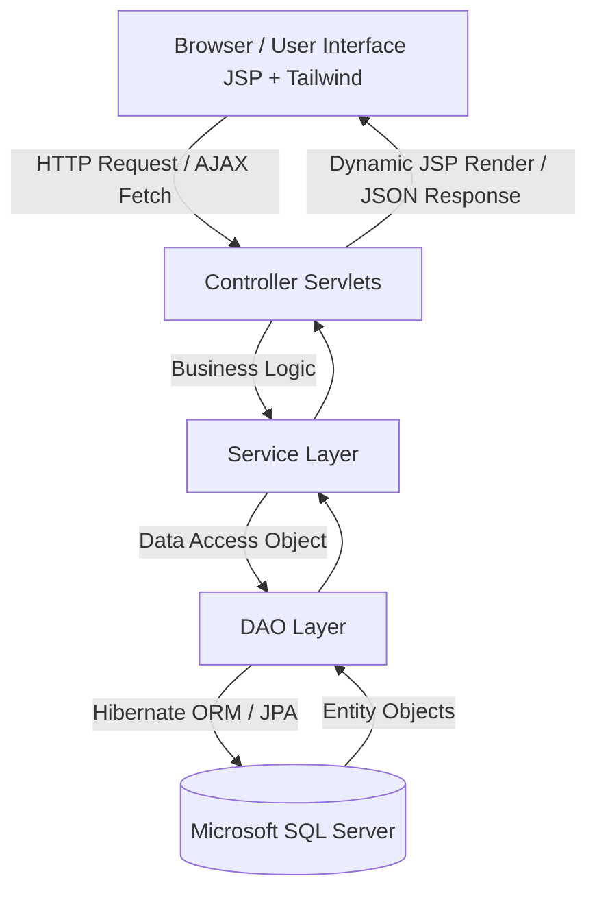

# V-SPORT — Hệ thống số hóa quản lý vận hành cơ sở thể thao & đặt sân trực tuyến


**V-SPORT** là một nền tảng Web App toàn diện được xây dựng trên nền tảng **Java Servlet/JSP (Jakarta EE)** kết hợp với **JPA/Hibernate** và cơ sở dữ liệu **Microsoft SQL Server**. Hệ thống được thiết kế nhằm số hóa quy trình quản lý, vận hành các trung tâm/cơ sở thể thao đa năng (Bóng đá, Cầu lông, Tennis, Bóng rổ, v.v.), hỗ trợ đặt sân trực tuyến tích hợp thanh toán QR, tối ưu hóa phân lịch ca làm việc nhân sự, đồng thời kết nối cộng đồng thông qua mô hình ghép kèo tính điểm ELO độc đáo.

---

## 1. Kiến trúc hệ thống & Công nghệ sử dụng (Tech Stack)

Hệ thống tuân thủ mô hình kiến trúc **MVC (Model-View-Controller)** truyền thống, chia thành các phân lớp rõ rệt:



### Chi tiết các phân lớp công nghệ:
*   **Core Backend**: Java 17, Jakarta EE 10 (Jakarta Servlet API 6.0.0, Jakarta Server Pages).
*   **Data Persistence (Phần mềm ORM)**: Jakarta Persistence API (JPA) 3.1.0, Hibernate ORM 6.4.4.Final.
*   **Connection Pool (Quản lý kết nối DB)**: HikariCP 5.1.0 cho hiệu suất truy cập database cao, ổn định.
*   **Cơ sở dữ liệu (Database)**: Microsoft SQL Server 2019/2022 (Được cấu hình trong `persistence.xml` với Unit Name: `SportPU`).
*   **Mã hóa mật khẩu**: BCrypt (`jbcrypt 0.4`) băm mật khẩu bảo mật một chiều.
*   **Gửi Email OTP**: Angus Mail API (`jakarta.mail` 2.0.2 & `jakarta.activation` 2.1.2).
*   **Giao diện người dùng (Frontend)**: JSP kết hợp JSTL 3.0.0, Tailwind CSS (JIT CDN), Google Fonts (Inter), Google Material Symbols (Icons).
*   **Build Tool**: Apache Maven (đóng gói dạng `.war` để chạy trên Apache Tomcat 10.1).

---

## 2. Bản đồ cấu trúc thư mục dự án

```text
DATN/ (Thư mục gốc dự án)
├── src/
│   ├── main/
│   │   ├── java/org/example/
│   │   │   ├── controller/      # Các Servlets xử lý định tuyến (Routing) & kiểm soát luồng
│   │   │   │   ├── manager/     # Servlet riêng cho vai trò Quản lý
│   │   │   │   └── ...          # Đăng nhập, Đăng ký, Đặt sân, Thanh toán, SOS...
│   │   │   ├── dao/             # Các Interface truy xuất dữ liệu (Data Access Object)
│   │   │   │   └── impl/        # Các lớp triển khai DAO sử dụng EntityManager (JPA/Hibernate)
│   │   │   ├── model/           # Các JPA Entity đại diện cho các bảng trong SQL Server
│   │   │   ├── service/         # Lớp xử lý nghiệp vụ Logic (Business Services)
│   │   │   │   └── manager/     # Nghiệp vụ quản lý ca làm, nhân sự, sân bãi
│   │   │   ├── filter/          # Bộ lọc bảo mật, kiểm tra quyền đăng nhập (Authentication)
│   │   │   └── util/            # Các công cụ tiện ích (JPAUtil, EmailUtil, CaLamValidationEngine...)
│   │   ├── resources/
│   │   │   ├── META-INF/
│   │   │   │   └── persistence.xml # Cấu hình kết nối SQL Server và HikariCP Connection Pool
│   │   │   └── log4j2.xml       # Cấu hình hệ thống ghi nhận lịch sử lỗi (Logging)
│   │   └── webapp/              # Tài nguyên Web tĩnh và động
│   │       ├── admin/           # Trang JSP dành riêng cho Admin hệ thống
│   │       ├── manager/         # Trang JSP quản lý cơ sở (Nhân sự, Ca làm, Yêu cầu...)
│   │       ├── customer/        # Trang đặt sân, lịch sử giao dịch dành cho Khách hàng
│   │       ├── staff/           # Trang dành cho nhân viên trực ca
│   │       └── auth/            # Trang đăng nhập, đăng ký, xác thực OTP
└── pom.xml                      # Quản lý thư viện phụ thuộc của Maven
```

---

## 3. Các phân hệ chức năng chính

### Phân hệ 1: Quản lý đặt sân & Hóa đơn (Booking & POS)
*   **Chức năng**: Khách hàng tra cứu danh sách sân trống theo thời gian thực, đặt sân theo khung giờ mong muốn, áp dụng mã khuyến mãi (`KhuyenMai`), nhận hóa đơn thanh toán trực tiếp qua mã QR tĩnh/động (`MaQR`), chia hóa đơn cho nhóm chơi (`ChiaHoaDon`), và yêu cầu hoàn tiền nếu hủy lịch hợp lệ (`Hoantien`).
*   **Thành phần chính**:
    *   *Frontend*: `webapp/customer/dat-san.jsp`, `webapp/customer/history.jsp`
    *   *Backend*: [DatSanServlet.java](file:///c:/Users/nhan/Downloads/DATN/DATN/src/main/java/org/example/controller/DatSanServlet.java)
    *   *Thực thể*: `DatSan`, `Lichdatsan`, `HoaDon`, `ChiTietHoaDon`, `ChiaHoaDon`, `Hoantien`, `MaQR`.

### Phân hệ 2: Quản lý nhân sự, Xếp lịch làm việc (Staff Scheduling) & Điểm danh (Attendance)
*   **Chức năng**: Manager phân bổ và điều phối ca làm việc động cho nhân viên tại chi nhánh. Hệ thống tự động kiểm tra xung đột trùng ca, nghỉ phép, quá giờ làm việc và thời gian nghỉ tối thiểu qua động cơ luật (`CaLamValidationEngine`).
    *   **Quy trình đổi ca 2 bước**: Nhân viên gửi yêu cầu đổi ca làm việc cho nhau (`CaLamViecSwapRequest`). Nhân viên nhận yêu cầu phải bấm Đồng ý trước khi yêu cầu được chuyển tiếp lên Quản lý (Manager) để đưa ra quyết định phê duyệt/từ chối cuối cùng.
    *   **Quy trình điểm danh (Check-in/Check-out)**: Nhân viên trực ca thực hiện điểm danh vào ca (Check-in) và kết thúc ca (Check-out) trực quan ngay trên lịch làm việc. Trạng thái đi làm thực tế được ghi nhận tức thời lên màn hình giám sát của Quản lý.
    *   **Đơn xin nghỉ & Nguyện vọng**: Nhân viên gửi nguyện vọng rảnh/bận (`CaLamViecAvailability`) hoặc đơn xin nghỉ phép (`YeuCauNghi`). Tất cả quy trình duyệt từ Quản lý đều thực hiện qua AJAX thời gian thực.
*   **Thành phần chính**:
    *   *Frontend*: `webapp/manager/NhanSu.jsp`, `webapp/manager/CaLamViec.jsp` (Dành cho Quản lý); `webapp/staff/CaLamViec.jsp` (Dành cho Nhân viên)
    *   *Backend*: [QuanLyCaLamManagerServlet.java](file:///c:/Users/nhan/Downloads/DATN/DATN/src/main/java/org/example/controller/QuanLyCaLamManagerServlet.java), [YeuCauNghiManagerServlet.java](file:///c:/Users/nhan/Downloads/DATN/DATN/src/main/java/org/example/controller/YeuCauNghiManagerServlet.java), [StaffCaLamServlet.java](file:///c:/Users/nhan/Downloads/DATN/DATN/src/main/java/org/example/controller/StaffCaLamServlet.java), [CaLamService.java](file:///c:/Users/nhan/Downloads/DATN/DATN/src/main/java/org/example/service/manager/CaLamService.java)
    *   *Thực thể*: `CaLamViec`, `CaLamViecAudit`, `CaLamViecAvailability`, `CaLamViecSwapRequest`, `YeuCauNghi`.

### Phân hệ 3: Ghép kèo cộng đồng & Xếp hạng ELO (Matchmaking)
*   **Chức năng**: Cho phép người chơi đơn lẻ hoặc đội nhóm tạo/tìm kiếm các trận đấu giao lưu (Ghép kèo - `GhepKeo`). Sau mỗi trận đấu, dựa trên kết quả ghi nhận, hệ thống tính toán điểm số ELO tích lũy (`LichSuElo`) tương tự các bảng xếp hạng eSports để xếp hạng và ghép các cặp đối thủ có trình độ tương đồng, nâng cao tính hấp dẫn.
*   **Thành phần chính**:
    *   *Thực thể*: `GhepKeo`, `ChiTietGhepKeo`, `LichSuElo`.

### Phân hệ 4: Tiện ích vận hành IoT (An ninh & Bãi giữ xe)
*   **Chức năng**:
    *   *An ninh*: Tích hợp cơ chế cảnh báo SOS khẩn cấp (`YeuCauSOS`, `NhatKySOSGui`) tại chỗ để nhân viên lập tức nhận biết sân nào đang cần hỗ trợ an ninh/y tế.
    *   *Nhà xe*: Quản lý thẻ xe (`TheGiuXe`) gắn với mã vạch/RFID, lưu vết giờ vào/ra của các phương tiện (`LichXeRaVao`) nâng cao an toàn tài sản cơ sở.
*   **Thành phần chính**:
    *   *Thực thể*: `TheGiuXe`, `LichXeRaVao`, `YeuCauSOS`, `NhatKySOSGui`.

### Phân hệ 5: Quản lý Kho hàng & Dịch vụ đi kèm (Inventory & Add-on Services)
*   **Chức năng**: Quản lý danh mục hàng hóa (`DanhMucSanPham`), sản phẩm và dịch vụ cho thuê/bán lẻ tại quầy (`SanPham_DichVu`), quản lý số lượng tồn kho của chi nhánh, theo dõi nhập/xuất kho. Áp dụng cơ chế khóa bi quan (`LockModeType.PESSIMISTIC_WRITE`) khi xuất/nhập kho để tránh race condition và đảm bảo tính toàn vẹn dữ liệu.
*   **Thành phần chính**:
    *   *Frontend*: `webapp/manager/KhoDichVu.jsp`
    *   *Backend*: [KhoDichVuManagerServlet.java](file:///d:/New%20folder/V-SPORT/src/main/java/org/example/controller/manager/KhoDichVuManagerServlet.java)
    *   *Thực thể*: `SanPham_DichVu`, `DanhMucSanPham`.

### Phân hệ 6: Quản lý Sân bãi & Loại sân (Facility & Court Management)
*   **Chức năng**: Cấu hình và quản lý danh mục loại sân (`LoaiSan`), các sân bóng, cầu lông, tennis cụ thể (`San`) trực thuộc chi nhánh; theo dõi trực quan trạng thái sân (Sẵn sàng, Đang hoạt động, Bảo trì) theo thời gian thực.
*   **Thành phần chính**:
    *   *Frontend*: `webapp/manager/QuanLySan.jsp`
    *   *Backend*: [QuanLySanManagerServlet.java](file:///d:/New%20folder/V-SPORT/src/main/java/org/example/controller/QuanLySanManagerServlet.java), [QuanLySanServlet.java](file:///d:/New%20folder/V-SPORT/src/main/java/org/example/controller/QuanLySanServlet.java)
    *   *Thực thể*: `San`, `LoaiSan`, `CoSo`.

### Phân hệ 7: Quản lý Khách hàng & Đánh giá dịch vụ (Customer & Feedback Management)
*   **Chức năng**: Theo dõi danh sách khách hàng hoạt động tại chi nhánh, xem thông tin giao dịch, số ca đã chơi, điểm tích lũy uy tín và thống kê mức độ tương tác. Xem danh sách phản hồi/đánh giá sao (`DanhGia`) của khách hàng để nâng cấp chất lượng phục vụ.
*   **Thành phần chính**:
    *   *Backend*: [CustomerManagerServlet.java](file:///d:/New%20folder/V-SPORT/src/main/java/org/example/controller/manager/CustomerManagerServlet.java)
    *   *Thực thể*: `TaiKhoan`, `DanhGia`.

---

## 4. Từ điển Thực thể Cơ sở dữ liệu (JPA Entities Dictionary)

Hệ thống quản lý thông tin thông qua **32 JPA Entities** chính dưới đây:

| STT | Tên Thực thể (JPA Entity) | Mô tả chi tiết vai trò trong hệ thống |
|:---:|---|---|
| 1 | **TaiKhoan** | Lưu trữ thông tin tài khoản người dùng (Khách hàng, nhân viên, quản lý, admin). |
| 2 | **VaiTro** | Định nghĩa các quyền của tài khoản (Admin, Manager, Staff, Customer, Owner). |
| 3 | **CoSo** | Lưu trữ thông tin các chi nhánh / cơ sở thể thao trong hệ thống chuỗi. |
| 4 | **MonTheThao** | Định nghĩa môn thể thao được cung cấp (Bóng đá, Cầu lông, Bóng rổ...). |
| 5 | **LoaiSan** | Phân loại sân theo chất lượng / kích thước (Sân 5 người, Sân 7 người, Sân cỏ nhân tạo, Sân đất nện...). |
| 6 | **San** | Các sân cụ thể trực thuộc một chi nhánh cơ sở nhất định. |
| 7 | **DatSan** | Ghi nhận yêu cầu đặt lịch sân của khách hàng (Ngày, giờ, tổng tiền, trạng thái). |
| 8 | **Lichdatsan** | Lịch chi tiết đã được giữ chỗ theo khung giờ cụ thể để tránh đặt trùng. |
| 9 | **HoaDon** | Lưu trữ thông tin hóa đơn thanh toán cho mỗi giao dịch đặt sân hoặc dịch vụ đi kèm. |
| 10 | **ChiTietHoaDon** | Lưu trữ chi tiết các sản phẩm/dịch vụ mua thêm (Nước uống, thuê giày, bóng...). |
| 11 | **ChiaHoaDon** | Hỗ trợ tính năng chia nhỏ hóa đơn để nhóm người chơi thanh toán chung. |
| 12 | **Hoantien** | Quản lý quy trình xử lý yêu cầu hoàn tiền khi khách hàng hủy lịch hợp lệ. |
| 13 | **KhuyenMai** | Thông tin mã giảm giá, chương trình ưu đãi áp dụng vào hóa đơn đặt sân. |
| 14 | **CaLamViec** | Quản lý lịch phân ca làm việc của từng nhân viên theo ngày, giờ. |
| 15 | **CaLamViecAudit** | Lưu nhật ký thay đổi ca làm việc (ai thay đổi, thời gian, lý do) để kiểm soát nội bộ. |
| 16 | **CaLamViecAvailability** | Nguyện vọng báo thời gian rảnh/bận của nhân viên phục vụ xếp ca tự động. |
| 17 | **CaLamViecSwapRequest** | Quản lý luồng yêu cầu đổi ca làm việc giữa các nhân viên và phê duyệt của Manager. |
| 18 | **YeuCauNghi** | Quản lý đơn xin nghỉ phép của nhân viên (Ngày nghỉ, lý do, duyệt/từ chối). |
| 19 | **GhepKeo** | Quản lý các phòng chờ ghép trận đấu thể thao giữa các cá nhân/nhóm chơi. |
| 20 | **ChiTietGhepKeo** | Danh sách những người tham gia vào một kèo đấu ghép sân cụ thể. |
| 21 | **LichSuElo** | Nhật ký biến động điểm xếp hạng (ELO) của người chơi sau mỗi trận đấu. |
| 22 | **TheGiuXe** | Quản lý danh mục thẻ xe thông minh của chi nhánh. |
| 23 | **LichXeRaVao** | Ghi nhận nhật ký xe vào/ra bãi đỗ xe gắn liền với mã số thẻ xe. |
| 24 | **YeuCauSOS** | Các nút báo động khẩn cấp được thiết lập tại sân thể thao. |
| 25 | **NhatKySOSGui** | Lưu nhật ký thời gian và vị trí gửi cảnh báo khẩn cấp cần nhân viên xử lý. |
| 26 | **DanhGia** | Phản hồi, điểm đánh giá sao của khách hàng đối với dịch vụ cơ sở thể thao. |
| 27 | **SanPham_DichVu** | Danh mục nước uống, đồ ăn, vật dụng thể thao cho thuê hoặc bán tại quầy. |
| 28 | **DanhMucSanPham** | Danh mục phân loại sản phẩm/dịch vụ. |
| 29 | **ThongBao** | Hệ thống gửi thông điệp thông báo cho người dùng (Đã xếp ca, được duyệt nghỉ phép...). |
| 30 | **MonTheThaoYeuThich** | Lưu trữ sở thích thể thao của khách hàng nhằm gợi ý ghép kèo thích hợp. |
| 31 | **NhatKyChat** | Ghi nhận tin nhắn trao đổi trong phòng chờ ghép kèo thể thao. |
| 32 | **MaQR** | Mã QR liên kết phục vụ thanh toán nhanh trực tuyến hoặc check-in. |

---

## 5. Ma trận Phân quyền Tài khoản (User Roles Matrix)

Hệ thống quản lý chặt chẽ theo 5 vai trò tài khoản cốt lõi:

*   **1. Admin (Quản trị viên tối cao)**:
    *   Quản lý toàn bộ cơ sở dữ liệu hệ thống chuỗi.
    *   Thêm mới, sửa thông tin chi nhánh cơ sở (`CoSo`).
    *   Cấu hình loại sân (`LoaiSan`), môn thể thao (`MonTheThao`), cấu hình phân hạng ELO hệ thống.
    *   Xem báo cáo tổng thể doanh thu toàn chuỗi.
*   **2. Manager (Quản lý chi nhánh cơ sở)**:
    *   Quản lý trực tiếp các sân (`San`) thuộc cơ sở được chỉ định.
    *   Tạo, khóa tài khoản, phân bổ ca làm việc (`CaLamViec`) cho nhân viên trực thuộc chi nhánh.
    *   Phê duyệt đơn xin nghỉ phép (`YeuCauNghi`), yêu cầu đổi ca (`CaLamViecSwapRequest`).
    *   Xem biểu đồ thống kê doanh thu, tần suất sử dụng sân, dịch vụ của chi nhánh.
*   **3. Staff (Nhân viên trực ca: Lễ tân, Bảo vệ)**:
    *   *Lễ tân*: Tiếp đón khách, bán dịch vụ tại quầy, kích hoạt QR thanh toán hóa đơn, tiếp nhận yêu cầu hỗ trợ SOS khẩn cấp.
    *   *Bảo vệ*: Check-in/check-out xe ra vào bãi đỗ thông qua quét mã thẻ xe.
    *   Xem ca làm việc cá nhân, đăng ký nguyện vọng rảnh/bận, gửi đơn nghỉ phép.
*   **4. Customer (Khách hàng sử dụng dịch vụ)**:
    *   Tìm kiếm chi nhánh, loại sân thể thao trống.
    *   Tiến hành đặt sân, thanh toán chuyển khoản QR, quản lý lịch sử đặt sân của mình.
    *   Tạo phòng chờ ghép kèo, tìm đối thủ có cùng trình độ (hệ thống tự động lọc theo điểm ELO), chat nhóm, gửi nhận xét đánh giá dịch vụ.
*   **5. Owner (Chủ sở hữu thương hiệu - Tùy chọn mở rộng)**:
    *   Đăng ký tạo thương hiệu chuỗi thể thao mới trên nền tảng.
    *   Đăng ký tài khoản quản lý và liên kết cơ sở.

---

## 6. Hướng dẫn thiết lập & Vận hành dự án (Installation Guide)

### Yêu cầu hệ thống tối thiểu:
*   Java Development Kit (JDK) 17 hoặc cao hơn.
*   Apache Maven 3.8+.
*   Microsoft SQL Server 2019+.
*   Apache Tomcat Server 10.1+.

### Bước 1: Khởi tạo Cơ sở dữ liệu
1.  Cài đặt MS SQL Server và khởi chạy SQL Server Agent.
2.  Tạo một cơ sở dữ liệu trống tên là `QuanLiSport`.
3.  Thực hiện chạy các script SQL để tạo bảng hoặc chạy script khởi tạo dữ liệu mẫu nếu có.

### Bước 2: Cấu hình kết nối Database
Mở file cấu hình JPA tại đường dẫn: `src/main/resources/META-INF/persistence.xml` và cập nhật thông tin tài khoản SQL Server của bạn:
```xml
<property name="jakarta.persistence.jdbc.url" value="jdbc:sqlserver://localhost:1433;databaseName=QuanLiSport;encrypt=true;trustServerCertificate=true;"/>
<property name="jakarta.persistence.jdbc.user" value="Tên_đăng_nhập_của_bạn (Ví dụ: sa)"/>
<property name="jakarta.persistence.jdbc.password" value="Mật_khẩu_của_bạn"/>
```

### Bước 3: Đóng gói dự án bằng Maven
Chạy lệnh dưới đây tại thư mục gốc của dự án (nơi có file `pom.xml`) để tải các thư viện và đóng gói thành file `.war`:
```bash
mvn clean package
```
Sau khi chạy thành công, file `Backend_java-1.0-SNAPSHOT.war` sẽ được tạo ra trong thư mục `target/`.

### Bước 4: Chạy trên Apache Tomcat 10.1
1.  Copy file `.war` vừa tạo vào thư mục `webapps/` của Tomcat hoặc cấu hình trực tiếp deployment trong IDE (IntelliJ IDEA / Eclipse) sử dụng plugin **SmartTomcat** (chỉ định context path là `/`).
2.  Bật Tomcat Server.
3.  Truy cập hệ thống thông qua địa chỉ: `http://localhost:8080/` (hoặc cổng cấu hình tương ứng).

---

## 7. Nhật ký cập nhật hệ thống (System Update Log)

### Cập nhật ngày 22/06/2026: Nâng cấp Quy trình Đổi ca & Điểm danh Ca làm việc

#### 1. Quy trình hoán đổi ca làm việc (2 Bước Bảo mật & Minh bạch)
*   **Tách biệt tab điều hướng trên giao diện Nhân viên**: Chia nhỏ phần đổi ca làm việc trong [CaLamViec.jsp](file:///c:/Users/nhan/Downloads/DATN/DATN/src/main/webapp/staff/CaLamViec.jsp) thành 3 sub-tab: **Cần xác nhận** (yêu cầu đổi ca do đồng nghiệp gửi đến), **Tôi đã gửi** (các yêu cầu do bản thân khởi tạo), và **Lịch sử** (lưu vết tất cả các yêu cầu cũ). Có badge số lượng màu đỏ thông báo tại tab "Cần xác nhận".
*   **Xác nhận 2 bước**: 
    1.  Nhân viên A gửi yêu cầu đổi ca cho Nhân viên B -> Yêu cầu ở trạng thái `ChoXacNhan`.
    2.  Nhân viên B bấm **[Đồng ý]** -> Yêu cầu chuyển thành `ChoQuanLyDuyet`. (Nếu B bấm **[Từ chối]** -> Yêu cầu kết thúc ở trạng thái `TuChoi`).
    3.  Quản lý (Manager) sử dụng bộ lọc tìm các yêu cầu chờ duyệt trên giao diện [NhanSu.jsp](file:///c:/Users/nhan/Downloads/DATN/DATN/src/main/webapp/manager/NhanSu.jsp) để bấm **[Duyệt]** (hoán đổi ca trực tiếp trong CSDL) hoặc **[Từ chối]** (giữ nguyên ca làm việc).

#### 2. Tính năng Điểm danh (Chấm công) thời gian thực
*   **Hệ thống trạng thái ca làm việc mở rộng**:
    *   `Draft`: Ca nháp (Chỉ quản lý thấy).
    *   `Published`: Ca đã công bố (Nhân viên thấy nhưng chưa xác nhận).
    *   `Confirmed`: Ca đã xác nhận (Nhân viên đã đồng ý đi làm).
    *   `CheckedIn`: Đang làm việc (Nhân viên đã bấm điểm danh vào ca).
    *   `CheckedOut`: Đã hoàn thành (Nhân viên đã bấm kết thúc ca).
*   **Nhiệp vụ kiểm soát (Backend & CSDL)**:
    *   Sử dụng cột `TrangThai` hiện có trong bảng `CaLamViec` lưu giá trị `'CheckedIn'` và `'CheckedOut'` để tránh thay đổi cấu trúc bảng database.
    *   Thêm nghiệp vụ kiểm tra logic tại [CaLamService.java](file:///c:/Users/nhan/Downloads/DATN/DATN/src/main/java/org/example/service/manager/CaLamService.java): Nhân viên chỉ được phép điểm danh (check-in) các ca làm việc của ngày hôm nay.
    *   Tự động ghi nhận log hệ thống (`CHECK_IN` và `CHECK_OUT` audit log) khi nhân viên thao tác.
    *   **Hiển thị trực quan (Frontend)**:
        *   **Giao diện Nhân viên ([CaLamViec.jsp](file:///c:/Users/nhan/Downloads/DATN/DATN/src/main/webapp/staff/CaLamViec.jsp))**: Hiển thị nút **[Điểm danh vào ca]** (màu xanh lá) cho các ca hôm nay đã xác nhận. Khi đã check-in, nút chuyển thành **[Kết thúc ca]** (màu đỏ).
        *   **Giao diện Quản lý ([NhanSu.jsp](file:///c:/Users/nhan/Downloads/DATN/DATN/src/main/webapp/manager/NhanSu.jsp) và [CaLamViec.jsp](file:///c:/Users/nhan/Downloads/DATN/DATN/src/main/webapp/manager/CaLamViec.jsp))**: Trạng thái `CheckedIn` hiển thị huy hiệu xanh lá kèm theo chấm đỏ nhấp nháy chuyển động (pulsing live-dot) để quản lý nhận biết trực quan nhân viên nào đang làm việc tại sân. Trạng thái `CheckedOut` đổi sang huy hiệu xám "Đã hoàn thành".

### Cập nhật ngày 29/06/2026: Đồng bộ hóa quy trình Đặt Sân Online & Quầy và Cơ chế Tạm khóa 10 phút chống Race Condition

#### 1. Hợp nhất giao diện Lịch sử đặt sân của Khách hàng (Single-page UX)
*   **Loại bỏ trang lịch sử độc lập**: Loại bỏ tệp `LichSuDatSan.jsp` riêng biệt. Tích hợp toàn diện phần quản lý ca chơi trực tiếp vào trang Tìm & Đặt sân chính ([DatSan.jsp](file:///d:/New%20folder/V-SPORT/src/main/webapp/customer/DatSan.jsp)) dưới dạng **Modal Lịch sử** có thiết kế cao cấp đồng bộ.
*   **Định tuyến thông minh và tự động mở (Auto-open)**:
    *   Tất cả các liên kết lịch sử trên Header ([header.jsp](file:///d:/New%20folder/V-SPORT/src/main/webapp/common/header.jsp)) chuyển sang `/customer/dat-san?openHistory=true`.
    *   Servlet ([DatSanServlet.java](file:///d:/New%20folder/V-SPORT/src/main/java/org/example/controller/DatSanServlet.java)) thực hiện redirect tự động từ `/customer/lich-su-dat-san` sang trang tìm sân kèm tham số.
    *   Frontend tự động bắt tham số URL để kích hoạt mở modal lịch sử mà không cần tải lại trang.
*   **Tích hợp Thống kê (User Stats Sub-header)**: Đầu modal hiển thị Avatar viết hoa, email, tổng số ca chơi đã đặt và điểm uy tín cá nhân của khách hàng.

#### 2. Cơ chế Tạm khóa 10 phút (PayOS Timeout) & Giải phóng sân tự phục hồi (Self-healing)
*   **Bổ sung cột CSDL**: Thực thi SQL Alter thêm cột `CreatedTime DATETIME DEFAULT GETDATE()` vào bảng `LichDatSan` phục vụ ghi nhận thời điểm tạo đơn.
*   **Bộ chọn hình thức thanh toán**: Tích hợp bộ chọn hình thức thanh toán (PayOS quét mã cọc trực tuyến vs Tiền mặt tại quầy) có giao diện thẻ card hiện đại và các cảnh báo động trên checkout panel của khách hàng.
*   **Kiểm tra trùng lịch tự giải phóng**:
    *   Nếu chọn PayOS, ca đặt được khởi tạo ở trạng thái `Chờ thanh toán`.
    *   Truy vấn kiểm tra trùng lịch tại [DatSanServlet.java](file:///d:/New%20folder/V-SPORT/src/main/java/org/example/controller/DatSanServlet.java) và [CheckInDAO.java](file:///d:/New%20folder/V-SPORT/src/main/java/org/example/dao/CheckInDAO.java) tự động bỏ qua (loại trừ) các ca `Chờ thanh toán` đã quá 10 phút. Thiết kế này giúp sân bóng tự giải phóng và mở lại cho người dưới đặt mà không cần viết các tác vụ cron job ngầm phức tạp.
    *   Walk-in check-in của lễ tân sẽ chặn (block) nếu có ca thanh toán PayOS dưới 10 phút, và tự động bỏ qua nếu ca đó hết hạn.

#### 3. Khóa bi quan chống Race Condition khi Check-in Vãng lai
*   **Nghiệp vụ khóa dòng**: Bổ sung gợi ý khóa `WITH (UPDLOCK, ROWLOCK)` khi SELECT kiểm tra trạng thái Sân trong luồng mở sân cho khách vãng lai ([CheckInDAO.java](file:///d:/New%20folder/V-SPORT/src/main/java/org/example/dao/CheckInDAO.java)).
*   **Tác dụng**: Ngăn chặn triệt để xung đột tranh chấp dữ liệu khi Lễ tân mở sân tại quầy trùng khớp thời điểm mili-giây khách hàng bấm đặt trực tuyến trên Web.

### Cập nhật ngày 01/07/2026: Vá Lỗ hổng Bảo mật IDOR, Đồng bộ hóa Giao dịch Kho Hàng & Sửa lỗi JSP / bfcache

#### 1. Khắc phục triệt để các lỗ hổng IDOR & Cô lập dữ liệu chi nhánh
*   **Quản lý lịch ca làm định kỳ**: Vá lỗi IDOR trong `addShiftPattern` và `deleteShiftPattern` (ở [NhanSuService.java](file:///d:/New%20folder/V-SPORT/src/main/java/org/example/service/manager/NhanSuService.java) và [NhanSuManagerServlet.java](file:///d:/New%20folder/V-SPORT/src/main/java/org/example/controller/manager/NhanSuManagerServlet.java)) bằng cách nạp thông tin nhân sự và xác thực phân quyền chi nhánh (`BranchSecurityUtils.checkBranchAccess(staff.getCoSoId(), coSoId)`) trước khi ghi nhận thay đổi, ngăn quản lý cơ sở A thao tác ca làm của nhân viên cơ sở B.
*   **Xem chi tiết hồ sơ nhân viên**: Chuyển đổi phương thức sang `getStaffById(accountId, managerCoSoId)` trong [NhanSuService.java](file:///d:/New%20folder/V-SPORT/src/main/java/org/example/service/manager/NhanSuService.java) để thực thi kiểm tra bảo mật cô lập chi nhánh trực tiếp tại tầng Service layer trước khi kết xuất dữ liệu PII nhạy cảm và thông tin tài khoản ngân hàng.
*   **Phê duyệt và từ chối yêu cầu đổi ca**: Bổ sung kiểm tra branch chéo chi nhánh trong các phương thức `approveSwapRequest` và `rejectSwapRequest` ở [CaLamService.java](file:///d:/New%20folder/V-SPORT/src/main/java/org/example/service/manager/CaLamService.java) đối chiếu chi nhánh của người gửi yêu cầu đổi ca (`requester`) với chi nhánh của quản lý đang duyệt (`manager`).
*   **Cập nhật thông tin nhân viên**: Thêm bước kiểm tra quyền chi nhánh trước khi gửi mã xác thực OTP cập nhật email trong servlet nhân sự.

#### 2. Đồng bộ hóa an toàn giao dịch & Ngăn ngừa Race Condition Kho hàng
*   **Khóa ghi bi quan khi thay đổi số lượng**: Áp dụng khóa bi quan (`LockModeType.PESSIMISTIC_WRITE`) khi tải thông tin sản phẩm phục vụ hoạt động nhập/xuất kho tại [KhoDichVuManagerServlet.java](file:///d:/New%20folder/V-SPORT/src/main/java/org/example/controller/manager/KhoDichVuManagerServlet.java), loại bỏ hoàn toàn khả năng cập nhật đè dữ liệu (lost update) khi nhiều người thao tác hoặc bấm đúp.
*   **Giao dịch nguyên tử cho sản phẩm mẫu (Presets)**: Đóng gói tiến trình chèn loạt sản phẩm mẫu vào một JPA transaction duy nhất, đảm bảo tính toàn vẹn rollback nếu phát sinh lỗi giữa chừng.
*   **Dọn dẹp danh mục trùng lặp tối ưu**: Triển khai static lock (`categoryLock`) và cờ volatile `categoryCleaned` trong [KhoDichVuManagerServlet.java](file:///d:/New%20folder/V-SPORT/src/main/java/org/example/controller/manager/KhoDichVuManagerServlet.java) để tiến trình kiểm tra dọn dẹp chỉ kích hoạt duy nhất một lần khi khởi chạy hệ thống, tăng đáng kể tốc độ tải trang.

#### 3. Loại bỏ rò rỉ thông tin lỗi & Sửa lỗi im lặng (Silent failure)
*   **Rò rỉ lỗi hệ thống**: Loại bỏ các chỗ ghi đè `e.getMessage()` trực tiếp ra client tại `NhanSuManagerServlet.java` và `KhoDichVuManagerServlet.java`, thay bằng thông báo lỗi an toàn để bảo vệ cấu trúc hệ thống.
*   **Khắc phục lỗi im lặng**: Bổ sung tham số thuộc tính `errorMessage` lên request scope trong catch block của `CustomerManagerServlet.java` giúp giao diện JSP của quản lý thông báo lỗi kết nối rõ ràng thay vì hiển thị bảng trống không lý do.

#### 4. Sửa lỗi hiển thị Tiếng Việt (Mojibake Encoding)
*   Dọn dẹp và chuẩn hóa toàn bộ các chuỗi tiếng Việt bị lỗi hiển thị/vỡ font mã hóa ký tự UTF-8 (ví dụ: `Thêm nhân viên thành công!` -> `Thêm nhân viên thành công!`) trong servlet điều hành [NhanSuManagerServlet.java](file:///d:/New%20folder/V-SPORT/src/main/java/org/example/controller/manager/NhanSuManagerServlet.java).

#### 5. Sửa lỗi chức năng JSP & Vá lỗi bfcache (History Back/Forward)
*   **Sửa hàm Javascript chết (Dead functions)**: Cấu hình `id` động cho các form (`form-approve-${req.yeuCauNghiID}`) và chuyển các nút submit thành nút gọi hàm xác nhận `confirmApprove(id)` / `confirmReject(id)` trong [yeuCauNghi_list.jsp](file:///d:/New%20folder/V-SPORT/src/main/webapp/manager/yeuCauNghi_list.jsp).
*   **Vá lỗi bfcache**: Tích hợp trình lắng nghe sự kiện `pageshow` ở các trang manager ([KhoDichVu.jsp](file:///d:/New%20folder/V-SPORT/src/main/webapp/manager/KhoDichVu.jsp), [QuanLySan.jsp](file:///d:/New%20folder/V-SPORT/src/main/webapp/manager/QuanLySan.jsp), [CaLamViec.jsp](file:///d:/New%20folder/V-SPORT/src/main/webapp/manager/CaLamViec.jsp), [NhanSu.jsp](file:///d:/New%20folder/V-SPORT/src/main/webapp/manager/NhanSu.jsp), [yeuCauNghi_list.jsp](file:///d:/New%20folder/V-SPORT/src/main/webapp/manager/yeuCauNghi_list.jsp), [profile_dropdown.jsp](file:///d:/New%20folder/V-SPORT/src/main/webapp/manager/common/profile_dropdown.jsp)) để buộc tải lại dữ liệu mới nhất từ máy chủ khi bấm Back/Forward trên trình duyệt.
