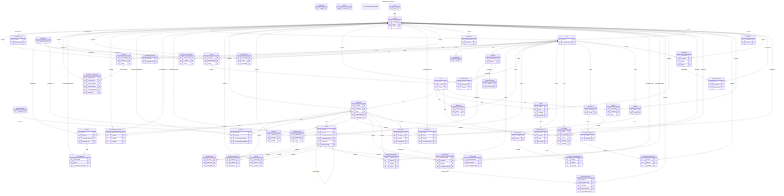
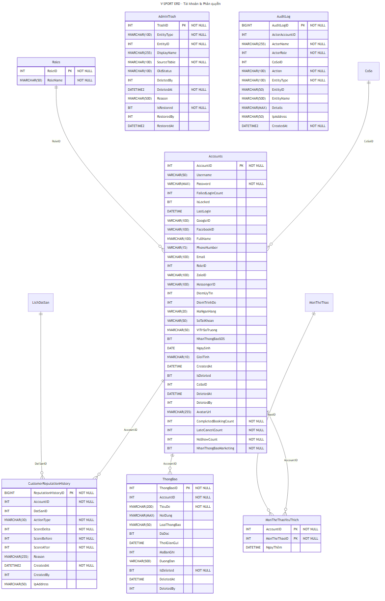
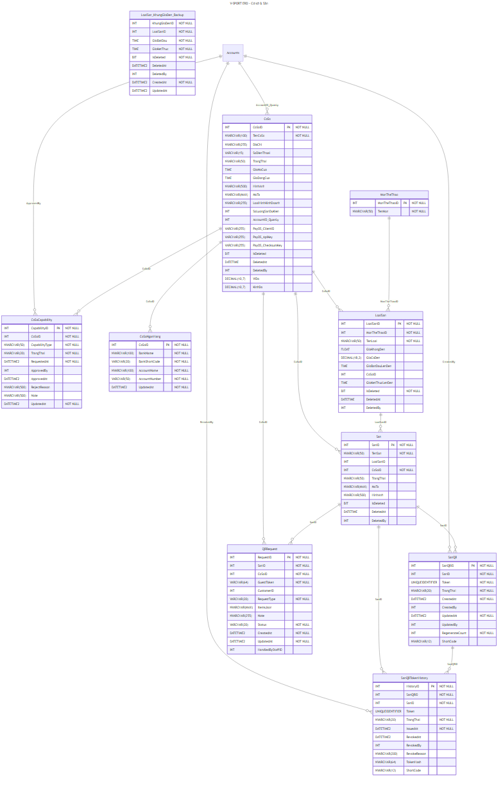
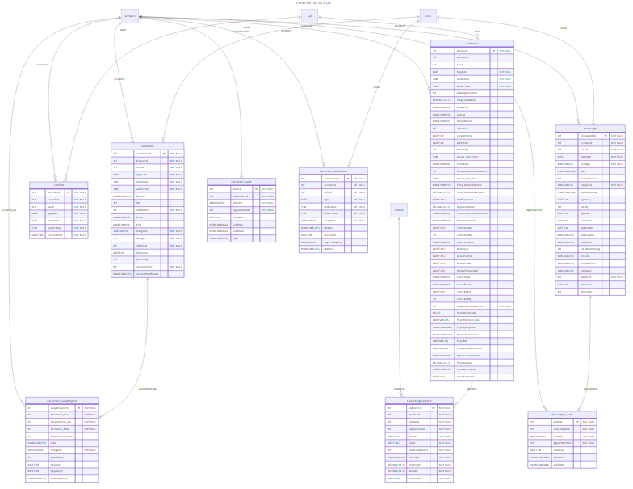
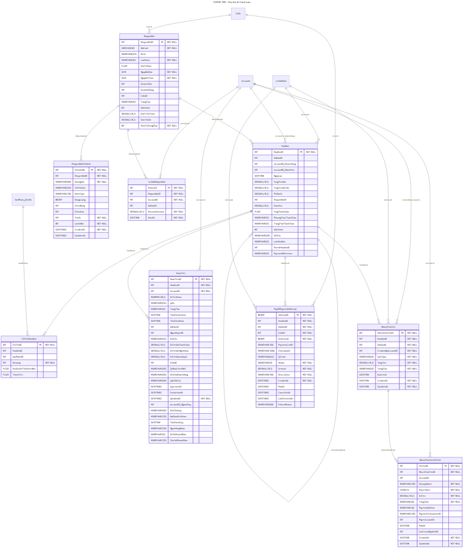
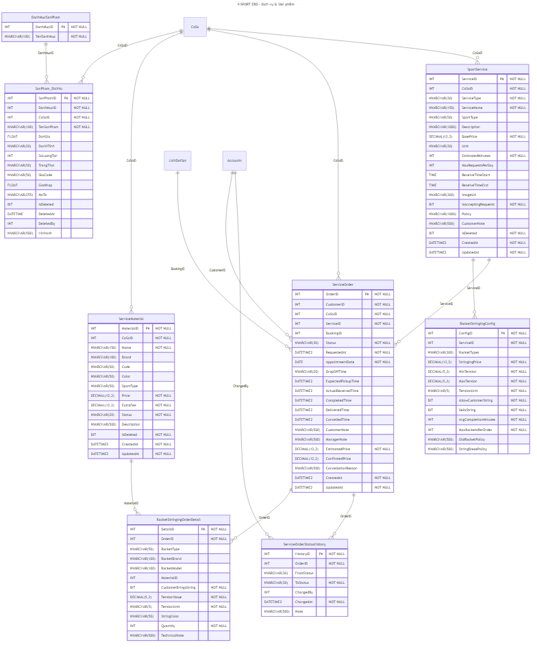
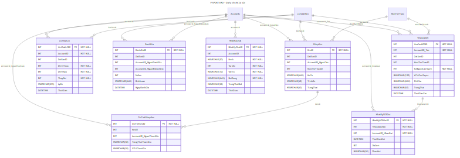
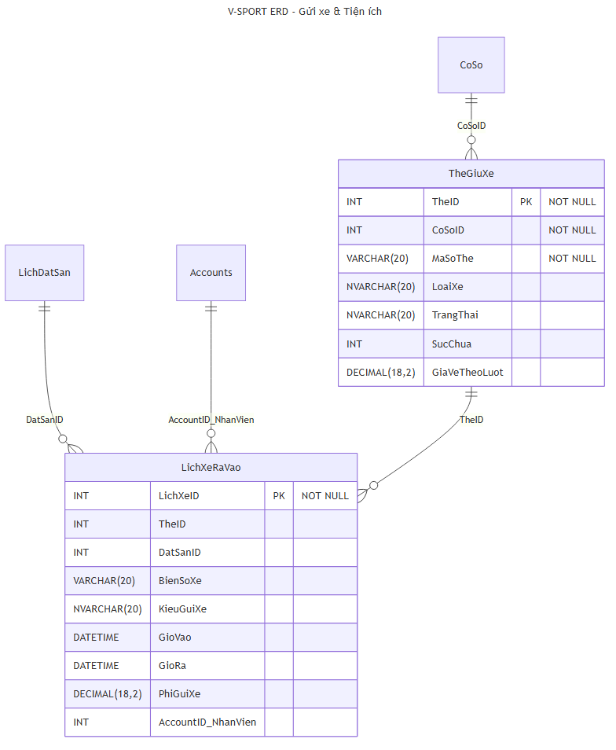

# V-SPORT — ERD Database Schema

> Tự động sinh từ database `QuanLiSport` (SQL Server `14.225.217.109:1433`)  
> Ngày tạo: 2026-08-02

## Thống kê

| Mục | Số lượng |
|-----|---------|
| Tổng bảng | 53 |
| Foreign keys | 103 |
| Module ERD | 7 |

---

## Sơ đồ tổng quan

> Xem source: [erd-overview.mmd](erd-overview.mmd)

---

## ERD theo module

### 1. Tài khoản & Phân quyền
**Bảng:** `Accounts`, `Roles`, `AdminTrash`, `AuditLog`, `CustomerReputationHistory`, `MonTheThaoYeuThich`, `ThongBao`

> Xem source: [erd-accounts.mmd](erd-accounts.mmd)

---

### 2. Cơ sở & Sân
**Bảng:** `CoSo`, `CoSoCapability`, `CoSoNganHang`, `San`, `SanQR`, `SanQRTokenHistory`, `QRRequest`, `LoaiSan`, `LoaiSan_KhungGioDen_Backup`, `MonTheThao`

> Xem source: [erd-facilities.mmd](erd-facilities.mmd)

---

### 3. Đặt sân & Lịch
**Bảng:** `LichDatSan`, `SoftHold`, `CourtChargeSegment`, `CaLamViec`, `CaLamViec_Audit`, `CaLamViec_Availability`, `CaLamViec_SwapRequest`, `YeuCauNghi`, `YeuCauNghi_Audit`

> Xem source: [erd-booking.mmd](erd-booking.mmd)

---

### 4. Hóa đơn & Thanh toán
**Bảng:** `HoaDon`, `ChiTietHoaDon`, `HoanTien`, `KhuyenMai`, `KhuyenMaiHinhAnh`, `LichSuKhuyenMai`, `NhomChiaTien`, `NhomChiaTienChiTiet`, `PayOSPaymentAttempt`

> Xem source: [erd-billing.mmd](erd-billing.mmd)

---

### 5. Dịch vụ & Sản phẩm
**Bảng:** `SportService`, `ServiceOrder`, `ServiceOrderStatusHistory`, `ServiceMaterial`, `SanPham_DichVu`, `DanhMucSanPham`, `RacketStringingConfig`, `RacketStringingOrderDetail`

> Xem source: [erd-services.mmd](erd-services.mmd)

---

### 6. Ghép kèo & Xã hội
**Bảng:** `GhepKeo`, `ChiTietGhepKeo`, `LichSuELO`, `DanhGia`, `NhatKyChat`, `NhatKySOSGui`, `YeuCauSOS`

> Xem source: [erd-social.mmd](erd-social.mmd)

---

### 7. Gửi xe & Tiện ích
**Bảng:** `TheGiuXe`, `LichXeRaVao`

> Xem source: [erd-parking.mmd](erd-parking.mmd)

---

## Danh sách tất cả bảng (53 bảng)

| Bảng | Module |
|------|--------|
| Accounts | Tài khoản |
| AdminTrash | Tài khoản |
| AuditLog | Tài khoản |
| CaLamViec | Đặt sân |
| CaLamViec_Audit | Đặt sân |
| CaLamViec_Availability | Đặt sân |
| CaLamViec_SwapRequest | Đặt sân |
| ChiTietGhepKeo | Ghép kèo |
| ChiTietHoaDon | Thanh toán |
| CoSo | Cơ sở |
| CoSoCapability | Cơ sở |
| CoSoNganHang | Cơ sở |
| CourtChargeSegment | Đặt sân |
| CustomerReputationHistory | Tài khoản |
| DanhGia | Ghép kèo |
| DanhMucSanPham | Dịch vụ |
| GhepKeo | Ghép kèo |
| HoaDon | Thanh toán |
| HoanTien | Thanh toán |
| KhuyenMai | Thanh toán |
| KhuyenMaiHinhAnh | Thanh toán |
| LichDatSan | Đặt sân |
| LichSuELO | Ghép kèo |
| LichSuKhuyenMai | Thanh toán |
| LichXeRaVao | Gửi xe |
| LoaiSan | Cơ sở |
| LoaiSan_KhungGioDen_Backup | Cơ sở |
| MonTheThao | Cơ sở |
| MonTheThaoYeuThich | Tài khoản |
| NhatKyChat | Ghép kèo |
| NhatKySOSGui | Ghép kèo |
| NhomChiaTien | Thanh toán |
| NhomChiaTienChiTiet | Thanh toán |
| PayOSPaymentAttempt | Thanh toán |
| QRRequest | Cơ sở |
| RacketStringingConfig | Dịch vụ |
| RacketStringingOrderDetail | Dịch vụ |
| Roles | Tài khoản |
| San | Cơ sở |
| SanPham_DichVu | Dịch vụ |
| SanQR | Cơ sở |
| SanQRTokenHistory | Cơ sở |
| ServiceMaterial | Dịch vụ |
| ServiceOrder | Dịch vụ |
| ServiceOrderStatusHistory | Dịch vụ |
| SoftHold | Đặt sân |
| SportService | Dịch vụ |
| TheGiuXe | Gửi xe |
| ThongBao | Tài khoản |
| YeuCauNghi | Đặt sân |
| YeuCauNghi_Audit | Đặt sân |
| YeuCauSOS | Ghép kèo |
| sysdiagrams | Hệ thống |

---

## File schema đầy đủ

- [`schema-full.json`](schema-full.json) — Toàn bộ metadata: columns, PKs, FKs, indexes
- [`schema-summary.json`](schema-summary.json) — Tóm tắt theo module
